# Thiết kế Bounded Context & Kiến trúc Microservice — CAB System

Tài liệu này áp dụng Domain-Driven Design (DDD) để phân rã hệ thống CAB (đặt xe) thành các Bounded Context, mỗi Bounded Context tương ứng 1 Microservice sở hữu 1 CSDL riêng (Database-per-Service), không chia sẻ CSDL trực tiếp giữa các service. Nội dung được xây dựng dựa trên `srs.md` (Business Processes BP-01 → BP-10, Business Rules, Exceptions) đã phân tích trước đó.

---

## 1. Nguyên tắc thiết kế

| Nguyên tắc | Áp dụng |
|---|---|
| Database per Service | Mỗi Microservice sở hữu 1 CSDL riêng biệt; không service nào được truy vấn trực tiếp CSDL của service khác |
| Giao tiếp liên service | Chỉ qua API (đồng bộ, REST/gRPC) hoặc Event Bus (bất đồng bộ, VD: Kafka/RabbitMQ) |
| Tham chiếu dữ liệu ngoài | Một service chỉ lưu **ID tham chiếu** (VD: `customer_id`) đến entity thuộc service khác, không lưu bản sao toàn bộ dữ liệu, không tạo Foreign Key vật lý xuyên service |
| Nhất quán dữ liệu | Dùng **Saga Pattern** (choreography qua Event Bus) cho các giao dịch xuyên nhiều service (VD: Booking → Matching → Trip → Fare → Payment) thay vì Distributed Transaction/2PC |
| Phân loại Subdomain | Core / Supporting / Generic — quyết định mức đầu tư kỹ thuật cho từng Bounded Context |

### Phân loại Subdomain

| Loại | Bounded Context | Lý do |
|---|---|---|
| **Core Domain** | Booking, Matching & Dispatch, Trip | Đây là giá trị cốt lõi tạo lợi thế cạnh tranh của CAB System — thuật toán ghép nối tài xế và vòng đời chuyến đi |
| **Supporting Domain** | Customer, Driver & Vehicle, Fare, Payment, Location & Tracking | Cần thiết để vận hành Core Domain nhưng không phải điểm khác biệt cạnh tranh chính |
| **Generic Domain** | Identity & Access, Notification, Operations & Audit, Reporting & Analytics | Bài toán phổ biến, có thể dùng giải pháp/thư viện có sẵn trên thị trường |

---

## 2. Context Map tổng quan

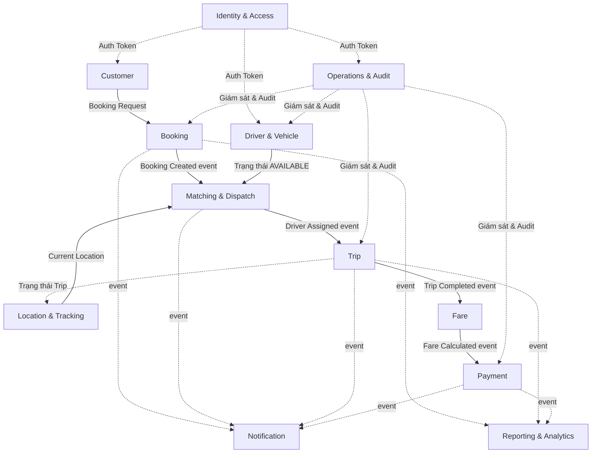

**Ghi chú quan hệ (Context Mapping pattern):**
- `Identity & Access` là **Shared Kernel/Open Host Service**: mọi context khác đều là Consumer, gọi qua API xác thực Token, không phụ thuộc ngược lại.
- `Booking → Matching → Trip → Fare → Payment` theo mô hình **Customer/Supplier** nối tiếp qua Event Bus (Choreography Saga).
- `Notification` và `Reporting` là **Published Language** consumer: chỉ lắng nghe sự kiện (event), không gọi ngược lại các context nguồn.
- `Operations & Audit` đóng vai trò **Anti-corruption Layer** giám sát, không chỉnh sửa trực tiếp dữ liệu nghiệp vụ của context khác mà qua API riêng của từng context.

---

## 3. Bảng tổng hợp Bounded Context → Microservice → CSDL

| # | Bounded Context | Microservice | CSDL sở hữu | Loại CSDL |
|---|---|---|---|---|
| 1 | Identity & Access | `identity-service` | `identity_db` | PostgreSQL (Relational) |
| 2 | Customer | `customer-service` | `customer_db` | PostgreSQL (Relational) |
| 3 | Driver & Vehicle | `driver-service` | `driver_db` | PostgreSQL (Relational) |
| 4 | Booking | `booking-service` | `booking_db` | PostgreSQL (Relational) |
| 5 | Matching & Dispatch | `matching-service` | `matching_store` | Redis (Key-Value + Geospatial) |
| 6 | Trip | `trip-service` | `trip_db` | PostgreSQL (Relational) |
| 7 | Location & Tracking | `location-service` | `location_db` | MongoDB Time Series + Redis cache |
| 8 | Fare | `fare-service` | `fare_db` | PostgreSQL (Relational) |
| 9 | Payment | `payment-service` | `payment_db` | PostgreSQL (Relational) |
| 10 | Notification | `notification-service` | `notification_db` | MongoDB (Document) |
| 11 | Operations & Audit | `operations-service` | `audit_db` | Elasticsearch / MongoDB (Document, append-only) |
| 12 | Reporting & Analytics | `reporting-service` | `reporting_dwh` | ClickHouse (Columnar OLAP) |

---

## 4. Chi tiết từng Bounded Context

### 4.1 Identity & Access Context

**Trách nhiệm:** Đăng ký/đăng nhập, phát hành và xác thực Token, quản lý Role/Permission cho toàn hệ thống (Customer, Driver, Operation Staff).

**Ubiquitous Language:**

| Thuật ngữ | Định nghĩa |
|---|---|
| User | Tài khoản gốc, có thể là Customer, Driver hoặc Operation Staff |
| Role | Vai trò gán cho User (Customer/Driver/OperationStaff/Admin) |
| Permission | Quyền hạn cụ thể gán cho Role (VD: `CANCEL_TRIP`, `VIEW_PAYMENT`) |
| Session/Token | Phiên xác thực (JWT), có thời hạn (`expires_at`) |
| Authentication | Xác minh danh tính (username/password) |
| Authorization | Xác minh quyền truy cập tài nguyên sau khi đã Authentication |

**ERD:**

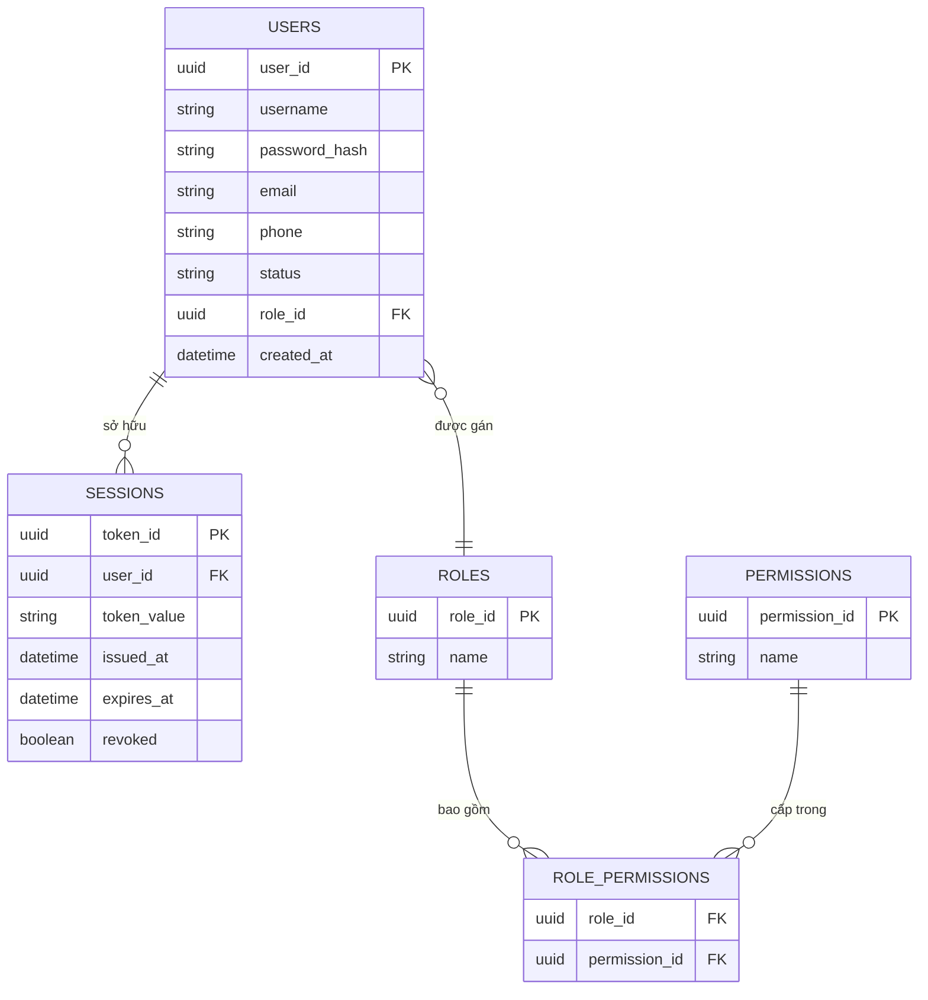

**Lý do chọn PostgreSQL:** Dữ liệu định danh, quyền hạn có cấu trúc cố định, đòi hỏi ràng buộc toàn vẹn (unique username, FK Role-Permission) và giao dịch ACID khi tạo tài khoản/gán quyền.

**Sự kiện phát ra:** `UserRegistered`, `UserAuthenticated`, `TokenRevoked`.

---

### 4.2 Customer Context

**Trách nhiệm:** Quản lý hồ sơ khách hàng, địa chỉ đã lưu, lịch sử tương tác cơ bản.

**Ubiquitous Language:**

| Thuật ngữ | Định nghĩa |
|---|---|
| Customer | Khách hàng đã có Profile trong hệ thống, tham chiếu đến `user_id` bên Identity |
| Profile | Thông tin cá nhân: tên, số điện thoại, email, rating |
| Saved Address | Địa chỉ khách hàng lưu sẵn để đặt xe nhanh |

**ERD:**

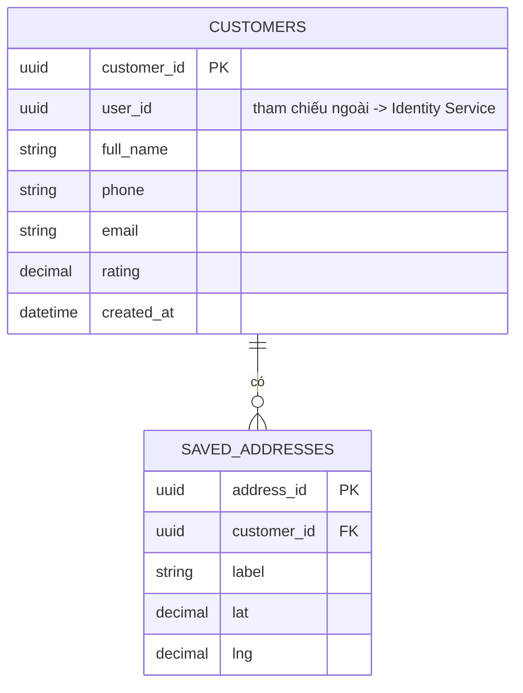

**Lý do chọn PostgreSQL:** Dữ liệu hồ sơ có quan hệ rõ ràng (Customer 1-n Saved Address), khối lượng ghi/đọc vừa phải, cần truy vấn theo điều kiện (tìm theo email, phone).

**Sự kiện phát ra:** `CustomerProfileUpdated`.

---

### 4.3 Driver & Vehicle Context

**Trách nhiệm:** Quản lý hồ sơ tài xế, phương tiện, trạng thái sẵn sàng (AVAILABLE/UNAVAILABLE).

**Ubiquitous Language:**

| Thuật ngữ | Định nghĩa |
|---|---|
| Driver | Tài xế đã đăng ký, tham chiếu `user_id` bên Identity |
| Vehicle | Phương tiện gắn với 1 Driver, có `vehicle_type` (Motorbike/Sedan/CAR_4_SEATS...) |
| AvailabilityStatus | Trạng thái AVAILABLE / UNAVAILABLE quyết định có được đưa vào Matching Pool hay không |
| ServiceType | Loại dịch vụ Vehicle đáp ứng, dùng để khớp với Booking |

**ERD:**

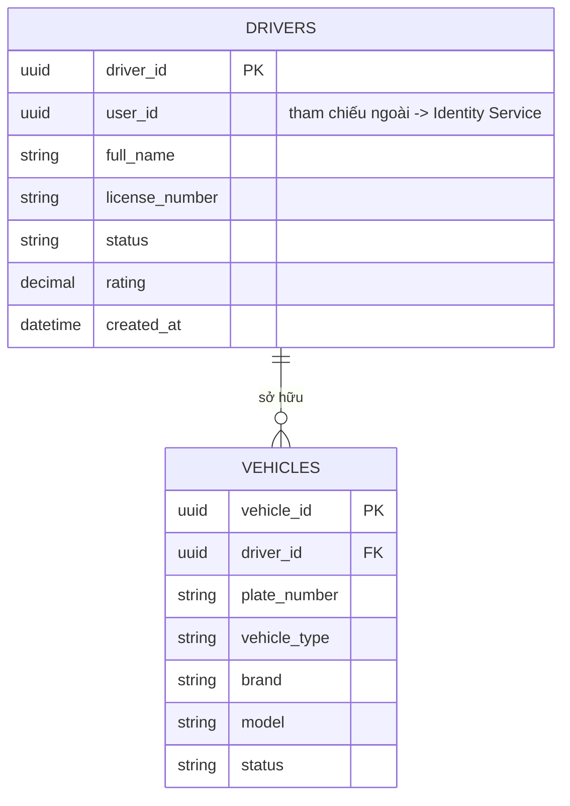

**Lý do chọn PostgreSQL:** Quan hệ Driver–Vehicle rõ ràng (1-n), cần ràng buộc duy nhất (plate_number), Operation Staff cần truy vấn/lọc phức tạp (theo status, theo vehicle_type).

**Sự kiện phát ra:** `DriverStatusChanged`, `VehicleRegistered`.
**Sự kiện lắng nghe:** `TripStarted`, `TripCompleted` (để tự động chuyển Driver về UNAVAILABLE/AVAILABLE).

---

### 4.4 Booking Context

**Trách nhiệm:** Tiếp nhận yêu cầu đặt xe, quản lý vòng đời Booking từ khi tạo đến khi có tài xế nhận hoặc bị hủy.

**Ubiquitous Language:**

| Thuật ngữ | Định nghĩa |
|---|---|
| Booking | Yêu cầu đặt xe của Customer, đơn vị nghiệp vụ trung tâm |
| Pickup Location / Destination | Điểm đón / điểm đến, lưu dạng tọa độ (lat, lng) |
| Booking State | CREATED → SEARCHING_DRIVER → DRIVER_ASSIGNED → CANCELLED / NO_DRIVER_FOUND |
| Cancellation Policy | Quy định trạng thái nào Customer được phép Cancel Booking |

**ERD:**

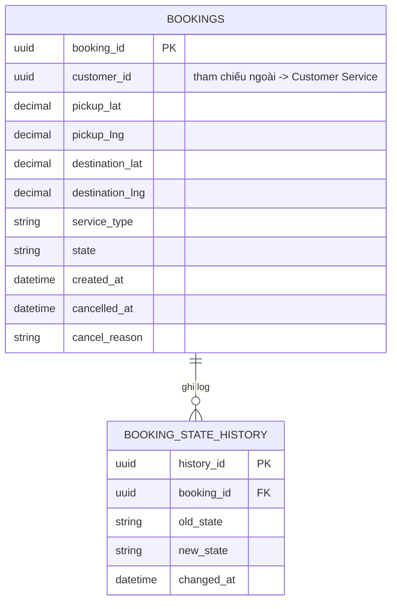

**Lý do chọn PostgreSQL:** Booking là Core Domain, đòi hỏi tính nhất quán ACID cao (không được sinh Booking trùng/mồ côi), cần lưu lịch sử trạng thái đầy đủ để audit và hỗ trợ Saga.

**Sự kiện phát ra:** `BookingCreated`, `BookingCancelled`.
**Sự kiện lắng nghe:** `DriverAssigned`, `MatchingFailed` (để cập nhật state tương ứng).

---

### 4.5 Matching & Dispatch Context

**Trách nhiệm:** Thuật toán ghép nối Booking với Driver phù hợp (lọc theo AvailabilityStatus, ServiceType, khoảng cách), quản lý khóa Assignment và Timeout.

**Ubiquitous Language:**

| Thuật ngữ | Định nghĩa |
|---|---|
| Matching Pool | Tập hợp Driver đủ điều kiện được xét cho 1 Booking tại 1 thời điểm |
| Trip Request | Lời mời gửi đến 1 Driver cụ thể, có thời hạn phản hồi (Timeout) |
| Assignment Lock | Cơ chế khóa Booking trong lúc chờ Driver phản hồi, tránh gửi trùng |
| Driver Priority | Điểm ưu tiên xếp hạng Driver (khoảng cách, rating...) |
| Timeout Policy | Quy định thời gian chờ tối đa trước khi coi Driver là không phản hồi |

**Mô hình dữ liệu (dạng khái niệm):**

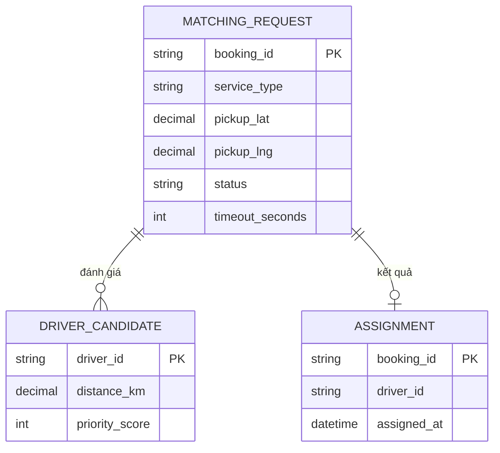

**Cấu trúc CSDL vật lý thực tế (Redis):**

| Key pattern | Kiểu dữ liệu Redis | Mục đích | TTL |
|---|---|---|---|
| `driver:geo` | Geo Set (GEOADD) | Chỉ mục vị trí toàn bộ Driver AVAILABLE để truy vấn `GEOSEARCH` theo bán kính | Cập nhật liên tục, không hết hạn |
| `booking:{id}:request` | Hash | Trạng thái Trip Request hiện tại: `driver_id`, `status`, `sent_at` | = `timeout_seconds` (tự xóa khi hết hạn) |
| `booking:{id}:lock` | String (SETNX) | Khóa Assignment, đảm bảo chỉ 1 Driver được xác nhận (chống Race Condition) | = `timeout_seconds` |
| `booking:{id}:pending_queue` | List | Danh sách Driver dự phòng tiếp theo nếu Driver hiện tại Reject/Timeout | Xóa khi có Assignment thành công |

**Lý do chọn Redis:** Đây là dữ liệu **ngắn hạn, đọc/ghi cực nhanh** (độ trễ mili-giây quyết định trải nghiệm), cần tính năng Geospatial Query dựng sẵn (`GEOSEARCH`), cần cơ chế khóa nguyên tử (`SETNX`) để xử lý Race Condition, và không cần lưu trữ lâu dài (dữ liệu tồn tại theo vòng đời 1 lần Matching). Kết quả Assignment cuối cùng được đẩy sang `trip-service` (PostgreSQL) để lưu vĩnh viễn.

**Sự kiện phát ra:** `DriverAssigned`, `MatchingFailed`, `DriverRejected`.
**Sự kiện lắng nghe:** `BookingCreated`, `DriverLocationUpdated`.

---

### 4.6 Trip Context

**Trách nhiệm:** Quản lý vòng đời chính thức của 1 chuyến đi từ khi Assignment thành công đến khi hoàn thành.

**Ubiquitous Language:**

| Thuật ngữ | Định nghĩa |
|---|---|
| Trip | Chuyến đi chính thức, chỉ tồn tại sau khi có Assignment |
| Trip State | ASSIGNED → DRIVER_EN_ROUTE → DRIVER_ARRIVED → IN_PROGRESS → COMPLETED |
| Trip Lifecycle | Quy tắc chuyển trạng thái tuần tự, không được bỏ bước |

**ERD:**

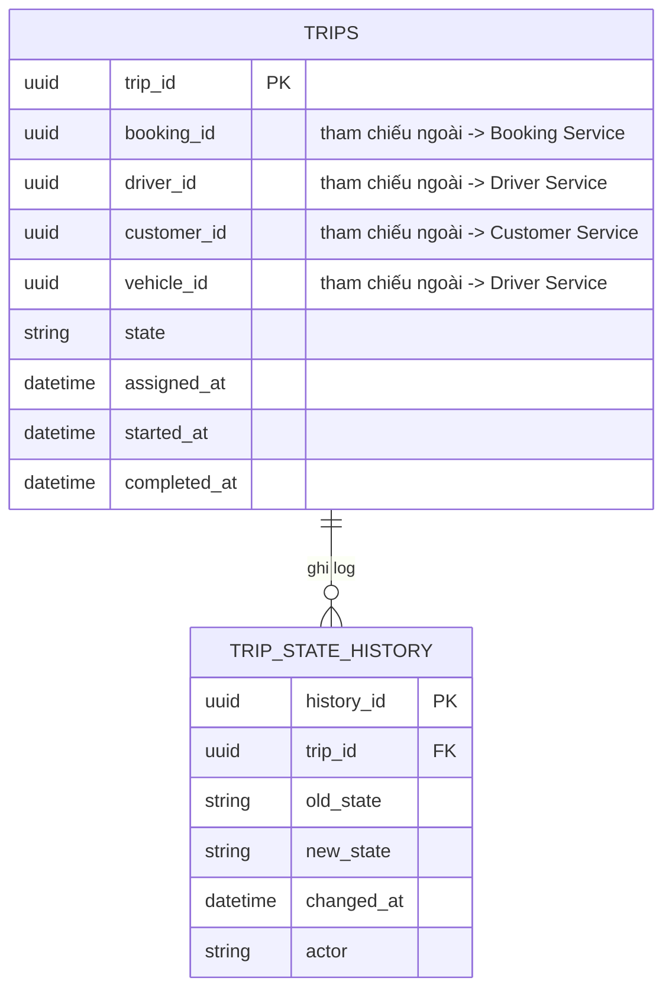

**Lý do chọn PostgreSQL:** Trip là Core Domain, cần ràng buộc chặt về thứ tự chuyển trạng thái (kiểm tra bằng transaction + constraint tầng ứng dụng), liên kết dữ liệu với nhiều context khác qua ID, và là nguồn sự thật (Source of Truth) để kích hoạt Fare/Payment.

**Sự kiện phát ra:** `TripAssigned`, `TripStarted`, `TripCompleted`.
**Sự kiện lắng nghe:** `DriverAssigned` (từ Matching).

---

### 4.7 Location & Tracking Context

**Trách nhiệm:** Thu thập vị trí GPS liên tục của Driver, cung cấp Current Location cho Matching, lưu lịch sử di chuyển, loại bỏ vị trí quá hạn (Stale).

**Ubiquitous Language:**

| Thuật ngữ | Định nghĩa |
|---|---|
| Location Ping | 1 lần cập nhật tọa độ GPS từ thiết bị Driver |
| Current Location | Vị trí mới nhất được xác nhận hợp lệ của 1 Driver |
| Stale Location | Vị trí đã quá cũ so với ngưỡng cho phép, không được dùng cho Matching |
| Location History | Toàn bộ lịch sử Location Ping, lưu theo Retention Policy |

**ERD (mô hình logic, ánh xạ vào Document/Time-series):**

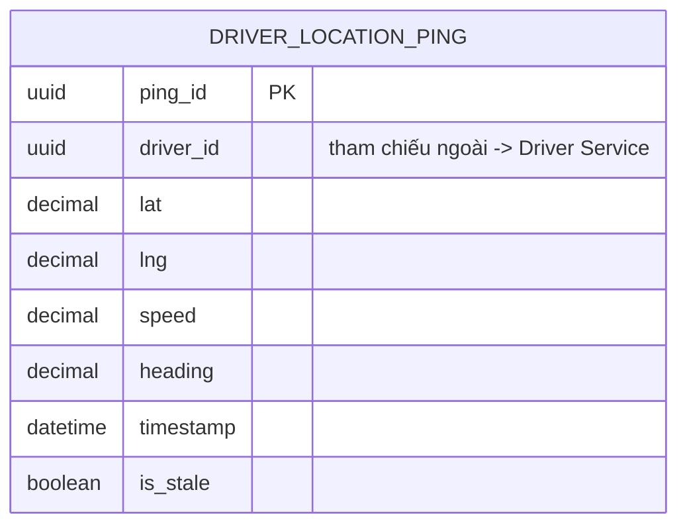

**Cấu trúc vật lý:**
- **MongoDB Time Series Collection** `driver_location_history`: lưu toàn bộ Location Ping theo thời gian, tối ưu ghi tần suất cao (mỗi Driver gửi ping mỗi 3-5 giây) và truy vấn theo khoảng thời gian; áp dụng TTL Index để tự xóa dữ liệu quá hạn theo Data Retention Policy.
- **Redis cache** key `driver:{id}:current_location` (Hash: lat, lng, timestamp): phục vụ đọc siêu nhanh cho Matching Service, ghi đè có điều kiện (chỉ cập nhật nếu `timestamp` mới hơn).

**Lý do chọn MongoDB Time Series + Redis:** Khối lượng ghi cực lớn, liên tục (write-heavy), không cần quan hệ phức tạp, cần khả năng mở rộng ngang (horizontal scaling) và TTL tự động — phù hợp mô hình NoSQL Document/Time-series hơn Relational.

**Sự kiện phát ra:** `DriverLocationUpdated`.

---

### 4.8 Fare Context

**Trách nhiệm:** Tính cước chuyến đi dựa trên Fare Policy khi Trip hoàn thành.

**Ubiquitous Language:**

| Thuật ngữ | Định nghĩa |
|---|---|
| Fare Policy | Công thức tính giá đã duyệt: Base Fare + Distance Fare + Time Fare |
| Fare | Kết quả tính cước cho 1 Trip cụ thể |
| Base / Distance / Time Fare | 3 thành phần cấu thành tổng cước |

**ERD:**

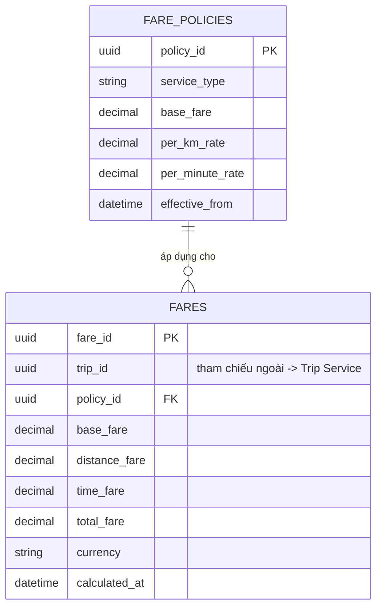

**Lý do chọn PostgreSQL:** Con số tài chính đòi hỏi độ chính xác kiểu `DECIMAL`, cần transaction đảm bảo Fare được tính đúng 1 lần cho mỗi Trip, và liên kết chặt với Fare Policy đang hiệu lực.

**Sự kiện phát ra:** `FareCalculated`.
**Sự kiện lắng nghe:** `TripCompleted`.

---

### 4.9 Payment Context

**Trách nhiệm:** Xử lý thanh toán (Cash/Electronic), giao tiếp Payment Provider, quản lý Retry khi thất bại — độc lập với trạng thái Trip.

**Ubiquitous Language:**

| Thuật ngữ | Định nghĩa |
|---|---|
| Payment Transaction | 1 giao dịch thanh toán gắn với 1 Trip/Fare |
| Payment Method | Cash hoặc Electronic |
| Payment Provider | Đối tác cổng thanh toán bên ngoài (Visa, MoMo, ZaloPay...) |
| Payment State | PENDING → SUCCESS / FAILED |
| Retry Policy | Số lần và khoảng cách thời gian giữa các lần thử lại khi Payment thất bại |

**ERD:**

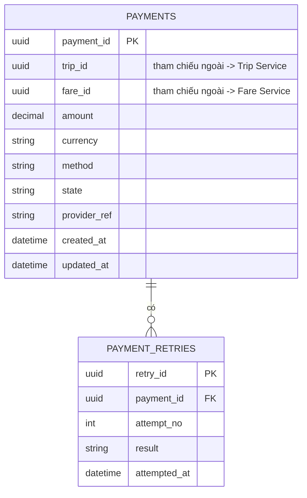

**Lý do chọn PostgreSQL:** Dữ liệu tài chính bắt buộc ACID, cần audit trail đầy đủ số lần Retry, không được phép mất mát hay ghi trùng giao dịch — quan trọng nhất trong toàn hệ thống về tính toàn vẹn.

**Sự kiện phát ra:** `PaymentSucceeded`, `PaymentFailed`.
**Sự kiện lắng nghe:** `FareCalculated`.

---

### 4.10 Notification Context

**Trách nhiệm:** Lắng nghe sự kiện nghiệp vụ từ các context khác và gửi thông báo (Push/SMS/Email) đến Customer/Driver.

**Ubiquitous Language:**

| Thuật ngữ | Định nghĩa |
|---|---|
| Notification Event | Sự kiện nghiệp vụ kích hoạt gửi thông báo (VD: Booking Created, Driver Assigned) |
| Channel | Kênh gửi: Push (FCM/WebSocket), SMS, Email |
| Delivery Status | SENT / DELIVERED / FAILED |

**ERD:**

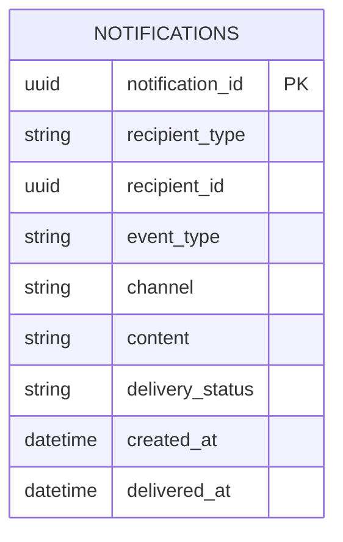

**Lý do chọn MongoDB:** Nội dung và cấu trúc thông báo khác nhau tùy `event_type`/`channel` (schema linh hoạt), khối lượng ghi lớn nhưng không cần quan hệ, phù hợp mô hình Document hơn Relational cứng nhắc.

**Sự kiện lắng nghe:** `BookingCreated`, `DriverAssigned`, `MatchingFailed`, `TripCompleted`, `PaymentFailed`.

---

### 4.11 Operations & Audit Context

**Trách nhiệm:** Cung cấp Dashboard giám sát cho Operation Staff, kiểm soát Permission cho thao tác nhạy cảm (Cancel Trip, Modify Driver...), lưu Audit Log cho mọi Sensitive Operation toàn hệ thống.

**Ubiquitous Language:**

| Thuật ngữ | Định nghĩa |
|---|---|
| Operation Staff | Nhân viên vận hành, thao tác qua Dashboard |
| Sensitive Operation | Thao tác có ảnh hưởng nghiệp vụ lớn, bắt buộc phải Audit (Cancel Trip, Modify Driver...) |
| Audit Log | Bản ghi bất biến: User, Action, Resource, Timestamp, Result |
| Monitoring | Khả năng xem trạng thái tổng quan Driver/Booking/Trip/Payment theo thời gian thực |

**ERD:**

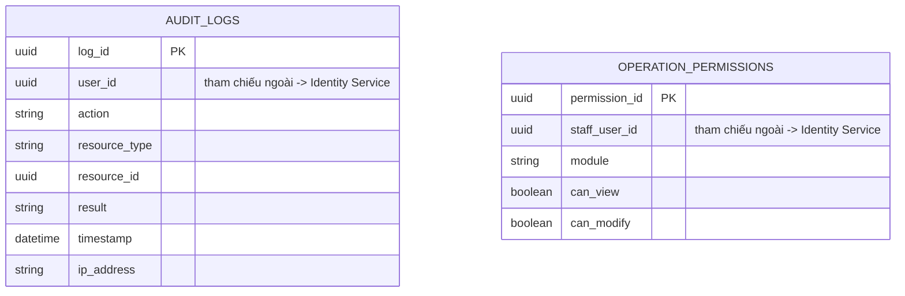

**Lý do chọn Elasticsearch/MongoDB:** Audit Log là dữ liệu **append-only, khối lượng lớn, tăng liên tục**, cần khả năng tìm kiếm full-text/filter nhanh theo nhiều tiêu chí (User, Action, Resource, khoảng thời gian) để phục vụ điều tra sự cố — đây là thế mạnh của Elasticsearch so với Relational DB truyền thống.

**Sự kiện lắng nghe:** tất cả sự kiện có gắn cờ Sensitive Operation từ mọi context khác (qua Event Bus, không truy vấn trực tiếp CSDL của context khác).

---

### 4.12 Reporting & Analytics Context

**Trách nhiệm:** Tổng hợp báo cáo doanh thu, tỷ lệ hoàn thành/hủy chuyến, hiệu suất Driver — phục vụ phân tích dài hạn, không phục vụ giao dịch thời gian thực.

**Ubiquitous Language:**

| Thuật ngữ | Định nghĩa |
|---|---|
| Fact Trip | Bản ghi sự kiện 1 chuyến đi đã hoàn tất, dùng cho phân tích |
| Dimension | Chiều phân tích: theo Driver, theo Customer, theo thời gian |
| Aggregate Report | Báo cáo tổng hợp theo kỳ (ngày/tuần/tháng) |

**ERD (mô hình Star Schema):**

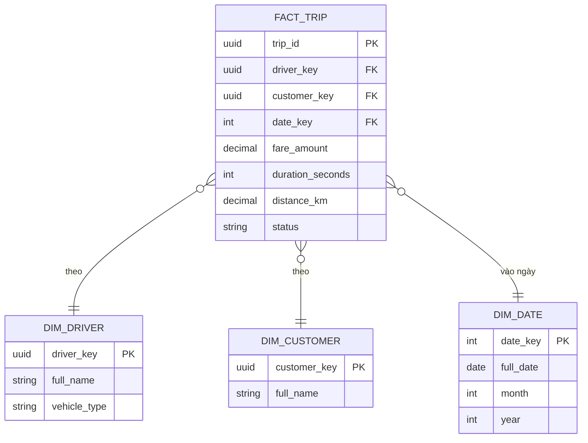

**Lý do chọn ClickHouse (Columnar OLAP):** Truy vấn báo cáo chủ yếu là `SUM`, `COUNT`, `GROUP BY` trên hàng triệu bản ghi lịch sử — CSDL dạng cột (Columnar) cho hiệu năng vượt trội so với Relational hàng-dòng (Row-based) truyền thống trong khối lượng công việc phân tích (OLAP). Dữ liệu được nạp vào qua CDC (Change Data Capture)/Event Bus từ `booking-service`, `trip-service`, `payment-service`, không truy vấn trực tiếp CSDL nguồn.

**Sự kiện lắng nghe:** `BookingCreated`, `BookingCancelled`, `TripCompleted`, `PaymentSucceeded`.

---

## 5. Tổng kết lựa chọn công nghệ CSDL

| Đặc điểm khối lượng công việc | CSDL phù hợp | Bounded Context áp dụng |
|---|---|---|
| Giao dịch có cấu trúc, cần ACID, quan hệ rõ ràng | **PostgreSQL** | Identity & Access, Customer, Driver & Vehicle, Booking, Trip, Fare, Payment |
| Đọc/ghi siêu nhanh, dữ liệu ngắn hạn, cần Geospatial & Lock nguyên tử | **Redis** | Matching & Dispatch (+ cache phụ cho Location) |
| Ghi liên tục tần suất cao, schema linh hoạt, cần TTL tự động | **MongoDB (Document/Time Series)** | Location & Tracking, Notification |
| Dữ liệu append-only, cần full-text search/filter điều tra | **Elasticsearch / MongoDB** | Operations & Audit |
| Phân tích tổng hợp trên khối lượng lớn (OLAP) | **ClickHouse (Columnar)** | Reporting & Analytics |

**Nguyên tắc "Polyglot Persistence"** được áp dụng nhất quán: mỗi Bounded Context chọn loại CSDL tối ưu nhất cho đặc thù khối lượng công việc của chính nó, thay vì ép toàn bộ hệ thống dùng chung 1 loại CSDL.
