# CAB System - Business Analysis & Requirements

## 1. Nghiệp vụ chính

CAB System số hóa toàn bộ quy trình đặt xe và thực hiện chuyến, từ lúc Customer tạo yêu cầu đặt xe cho đến khi Trip hoàn thành, thanh toán và đánh giá Driver.

### 1.1. Main Business Flow

```text
Customer
    │
    ▼
Đăng nhập
    │
    ▼
Nhập Pickup Location / Destination
    │
    ▼
Chọn loại xe / dịch vụ
    │
    ▼
Tạo Booking Request
    │
    ▼
Hệ thống tìm Driver
    │
    ▼
Driver nhận Trip
    │
    ▼
Driver đến Pickup Location
    │
    ▼
Đón Customer
    │
    ▼
Di chuyển
    │
    ▼
Trip hoàn thành
    │
    ▼
Tính Fare
    │
    ▼
Thanh toán
    │
    ▼
Customer đánh giá Driver
```

### 1.2. Các hoạt động song song

Trong quá trình Booking và Trip được thực hiện, hệ thống đồng thời thực hiện các hoạt động:

* Gửi Notification cho Customer và Driver.
* Thu thập và lưu GPS/Location của Driver.
* Cho phép Operation Staff theo dõi và xử lý các vấn đề phát sinh.
* Lưu lịch sử Booking và Trip.
* Lưu thông tin Payment Transaction.
* Lưu Audit Log đối với các thao tác quan trọng.
* Cung cấp Dashboard và Report cho Ban lãnh đạo.

### 1.3. Tổng quan nghiệp vụ

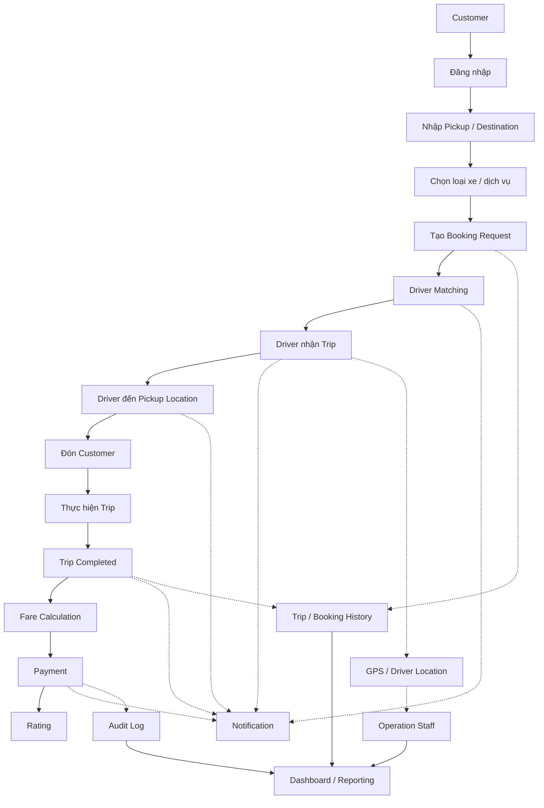

---

# 2. Mục đích của hệ thống

**CAB System** nhằm số hóa và tự động hóa toàn bộ quy trình đặt xe, điều phối Driver, thực hiện Trip, thanh toán và quản lý vận hành trên một nền tảng có khả năng mở rộng lâu dài.

Hệ thống hướng tới việc:

* Giảm các thao tác vận hành thủ công.
* Tự động hóa quy trình Driver Matching và Dispatch.
* Cải thiện trải nghiệm Customer.
* Tập trung hóa dữ liệu Booking, Trip, Payment và Operation.
* Hỗ trợ theo dõi Driver và Trip theo thời gian thực.
* Tăng khả năng mở rộng khi số lượng Customer và Driver tăng.
* Tăng khả năng tích hợp với các hệ thống bên ngoài.
* Cung cấp dữ liệu phục vụ Reporting và Business Decision Making.

---

# 3. Vấn đề kinh doanh

CAB System được xây dựng nhằm giải quyết các vấn đề hiện tại trong hoạt động kinh doanh đặt xe.

| ID    | Business Problem                                       | Impact                                 |
| ----- | ------------------------------------------------------ | -------------------------------------- |
| BP-01 | Phân công Driver còn thủ công                          | Tốn thời gian và tăng sai sót vận hành |
| BP-02 | Customer thiếu khả năng theo dõi Trip                  | Trải nghiệm Customer chưa tốt          |
| BP-03 | Thông tin Payment chưa tập trung                       | Khó tra cứu và đối soát                |
| BP-04 | Khó mở rộng khi số lượng User tăng                     | Giới hạn khả năng Scale                |
| BP-05 | Các bộ phận Operation thiếu hệ thống quản lý tập trung | Khó giám sát và xử lý sự cố            |
| BP-06 | Khó phát triển tính năng mới                           | Tăng Cost và Time phát triển           |

---

# 4. Bối cảnh kinh doanh

CAB System là nền tảng trung tâm hỗ trợ toàn bộ hoạt động kinh doanh đặt xe của **ABC**.

Hệ thống kết nối:

* **Customer** trong quá trình đặt và thực hiện Trip.
* **Driver** trong quá trình nhận và thực hiện Trip.
* **Operation Staff** trong quá trình quản lý và giám sát hoạt động.

CAB System tích hợp với các hệ thống bên ngoài:

* **Payment Provider**: cung cấp dịch vụ thanh toán.
* **Notification Provider**: cung cấp dịch vụ gửi Notification.
* **Map/GPS Provider**: cung cấp dịch vụ bản đồ và định vị.

Dữ liệu về Trip, Payment và Operation được tập trung trên hệ thống nhằm:

* Hỗ trợ vận hành.
* Hỗ trợ tra cứu.
* Hỗ trợ đối soát.
* Phục vụ Reporting.
* Hỗ trợ Ban lãnh đạo ra quyết định.

## 4.1. Business Context Model

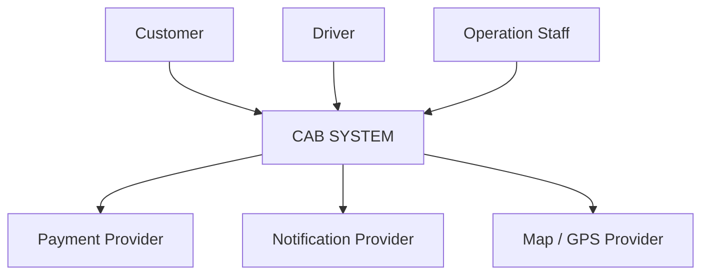

---

# 5. Mô hình hóa hệ thống

## 5.1. Business Capability Overview

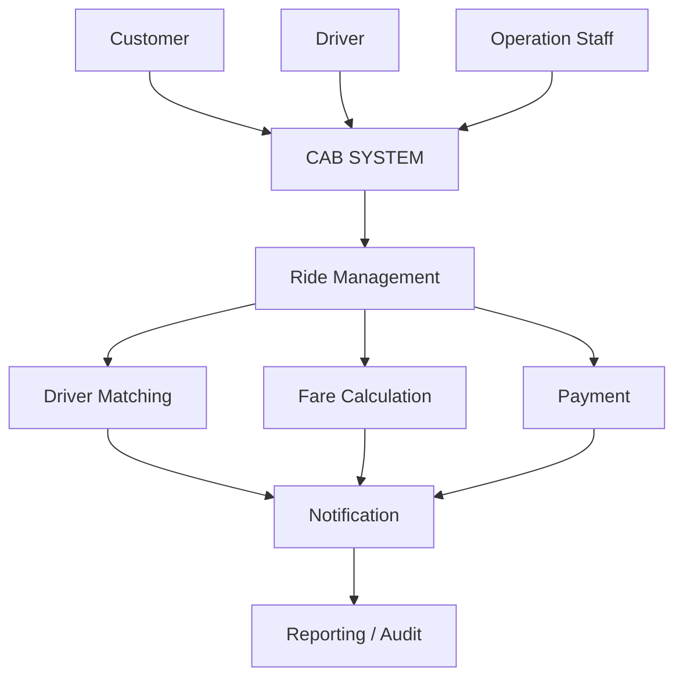

## 5.2. Các thành phần nghiệp vụ chính

### Customer

Customer sử dụng hệ thống để:

* Đăng ký tài khoản.
* Đăng nhập.
* Quản lý thông tin cá nhân.
* Tạo Booking.
* Theo dõi Booking/Trip.
* Hủy Booking theo Policy.
* Thanh toán.
* Xem lịch sử Trip.
* Đánh giá Driver.

### Driver

Driver sử dụng hệ thống để:

* Đăng nhập.
* Quản lý thông tin cá nhân.
* Quản lý Vehicle.
* Cập nhật trạng thái hoạt động.
* Cập nhật Location.
* Nhận Trip.
* Accept/Reject Trip.
* Thực hiện Trip.
* Cập nhật trạng thái Trip.

### Operation Staff

Operation Staff sử dụng hệ thống để:

* Quản lý Driver.
* Quản lý Vehicle.
* Theo dõi Driver.
* Theo dõi Booking.
* Theo dõi Trip.
* Theo dõi Payment.
* Xử lý các vấn đề vận hành.
* Tra cứu dữ liệu.
* Theo dõi Dashboard.
* Kiểm tra Audit Log theo quyền được cấp.

---

# 6. Business Goals

CAB System có các Business Goals sau:

| ID      | Business Goal                            | Mục tiêu                          |
| ------- | ---------------------------------------- | --------------------------------- |
| **BG1** | Tự động hóa Booking & Driver Dispatch    | Giảm Manual Operation             |
| **BG2** | Nâng cao Customer Experience             | Tăng Customer Satisfaction        |
| **BG3** | Tối ưu hiệu quả Driver                   | Tăng Operational Efficiency       |
| **BG4** | Tập trung hóa quản lý dữ liệu & vận hành | Dễ quản lý, giảm sai sót          |
| **BG5** | Hỗ trợ mở rộng quy mô                    | Phục vụ nhiều Customer/Driver hơn |
| **BG6** | Tăng Reliability & Resilience            | Giảm ảnh hưởng của sự cố          |
| **BG7** | Tạo nền tảng mở rộng trong tương lai     | Giảm Cost/Time phát triển         |
| **BG8** | Hỗ trợ quản trị dựa trên dữ liệu         | Ra quyết định tốt hơn             |
| **BG9** | Tăng Security & Control                  | Giảm Business Risk                |

---

# 7. Business Scope

## 7.1. In Scope

CAB System sẽ cung cấp nền tảng quản lý và đặt xe trực tuyến, bao gồm:

* Customer Account Management.
* Driver Account Management.
* Vehicle Management.
* Booking Management.
* Driver Matching.
* Driver Dispatch.
* Trip Lifecycle Management.
* Driver Location Management.
* Fare Calculation.
* Payment Integration.
* Notification.
* Operation Management.
* Reporting.
* Role & Permission Management.
* Audit Logging.

Hệ thống phải đảm bảo:

* Khả năng mở rộng.
* Security.
* Reliability.
* Resilience đối với các thành phần tích hợp bên ngoài.

## 7.2. External Integrations

CAB System tích hợp với:

* Payment Provider.
* Notification Provider.
* Map/GPS Provider.

## 7.3. Business Policies cần xác nhận

Các chính sách sau cần được xác nhận với các Stakeholder trước khi Baseline Requirement:

* Fare Policy.
* Driver Matching Policy.
* Driver Priority Policy.
* Cancellation Policy.
* Payment Retry Policy.
* Network Handling Policy.
* Data Retention Policy.
* Timeout Policy khi Driver không phản hồi.
* Chính sách xử lý khi không tìm được Driver.

---

# 8. Business Scope Model

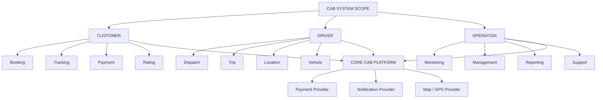

---

# 9. Business Requirements

## BR-01 - Customer Management

### Mục tiêu

Hệ thống cho phép doanh nghiệp quản lý tập trung thông tin và tài khoản Customer.

### Requirements

| ID          | Requirement                                                                   |
| ----------- | ----------------------------------------------------------------------------- |
| **BR-01.1** | Customer có thể đăng ký tài khoản.                                            |
| **BR-01.2** | Customer có thể đăng nhập.                                                    |
| **BR-01.3** | Customer có thể cập nhật thông tin cá nhân.                                   |
| **BR-01.4** | Hệ thống xác thực Customer trước khi sử dụng các chức năng yêu cầu tài khoản. |
| **BR-01.5** | Hệ thống lưu lịch sử Trip của Customer.                                       |

---

## BR-02 - Driver & Vehicle Management

### Mục tiêu

Hệ thống hỗ trợ doanh nghiệp quản lý tập trung Driver, Vehicle và trạng thái hoạt động.

### Requirements

| ID          | Requirement                                                    |
| ----------- | -------------------------------------------------------------- |
| **BR-02.1** | Driver có thể đăng ký hoặc được Operation Staff tạo tài khoản. |
| **BR-02.2** | Driver có thể cập nhật thông tin cá nhân.                      |
| **BR-02.3** | Driver có thể cập nhật thông tin Vehicle.                      |
| **BR-02.4** | Driver có thể cập nhật trạng thái hoạt động.                   |
| **BR-02.5** | Hệ thống xác định Driver đang sẵn sàng nhận Trip.              |
| **BR-02.6** | Hệ thống lưu thông tin Location của Driver.                    |
| **BR-02.7** | Operation Staff có thể kiểm tra trạng thái Driver.             |

---

## BR-03 - Booking Management

### Mục tiêu

Hệ thống cho phép Customer tạo và theo dõi yêu cầu đặt xe.

### Requirements

| ID          | Requirement                                           |
| ----------- | ----------------------------------------------------- |
| **BR-03.1** | Customer nhập Pickup Location.                        |
| **BR-03.2** | Customer nhập Destination.                            |
| **BR-03.3** | Customer chọn loại xe/dịch vụ.                        |
| **BR-03.4** | Customer gửi Booking Request.                         |
| **BR-03.5** | Hệ thống ghi nhận thời điểm tạo Booking.              |
| **BR-03.6** | Customer có thể theo dõi trạng thái Booking.          |
| **BR-03.7** | Customer có thể hủy Booking theo Cancellation Policy. |

---

## BR-04 - Driver Matching & Dispatch

### Mục tiêu

Hệ thống tự động tìm và phân công Driver phù hợp cho Booking.

### Requirements

| ID           | Requirement                                                                |
| ------------ | -------------------------------------------------------------------------- |
| **BR-04.1**  | Xác định các Driver đủ điều kiện nhận Booking.                             |
| **BR-04.2**  | Xem xét Location của Driver.                                               |
| **BR-04.3**  | Xem xét trạng thái sẵn sàng của Driver.                                    |
| **BR-04.4**  | Áp dụng tiêu chí ưu tiên Driver.                                           |
| **BR-04.5**  | Gửi Trip Request đến Driver được lựa chọn.                                 |
| **BR-04.6**  | Driver có thể Accept hoặc Reject Trip.                                     |
| **BR-04.7**  | Nếu Driver Reject, hệ thống tìm Driver khác.                               |
| **BR-04.8**  | Nếu Driver không phản hồi, hệ thống xử lý theo Timeout Policy.             |
| **BR-04.9**  | Customer không cần tạo lại Booking khi Driver từ chối hoặc không phản hồi. |
| **BR-04.10** | Nếu không tìm được Driver, hệ thống thông báo cho Customer.                |

---

# 10. Business Processes

| ID        | Business Process                | Mô tả                                                                             |
| --------- | ------------------------------- | --------------------------------------------------------------------------------- |
| **BP-01** | **Customer Management**         | Đăng ký, đăng nhập, cập nhật thông tin và xem lịch sử Trip của Customer.          |
| **BP-02** | **Driver & Vehicle Management** | Quản lý tài khoản Driver, Vehicle và trạng thái sẵn sàng nhận Trip.               |
| **BP-03** | **Ride Booking**                | Customer nhập Pickup Location, Destination, chọn loại xe và tạo Booking Request.  |
| **BP-04** | **Driver Matching & Dispatch**  | Hệ thống tìm Driver phù hợp, gửi yêu cầu và xử lý Accept/Reject/Timeout.          |
| **BP-05** | **Trip Execution**              | Driver thực hiện Trip và cập nhật trạng thái từ lúc nhận Trip đến khi hoàn thành. |
| **BP-06** | **Fare & Payment**              | Tính Fare, lựa chọn phương thức Payment và xử lý kết quả giao dịch.               |
| **BP-07** | **Notification**                | Gửi Notification cho Customer/Driver về Booking, Driver, Trip và Payment.         |
| **BP-08** | **Operation Management**        | Operation Staff giám sát Customer, Driver, Trip, Payment và xử lý sự cố.          |
| **BP-09** | **Reporting & Analytics**       | Cung cấp báo cáo về Trip, doanh thu, tỷ lệ hoàn thành, hủy và hiệu suất Driver.   |
| **BP-10** | **Security & Audit**            | Xác thực, phân quyền, bảo vệ dữ liệu và lưu vết các thao tác quan trọng.          |

---

# 11. Business Process Flow

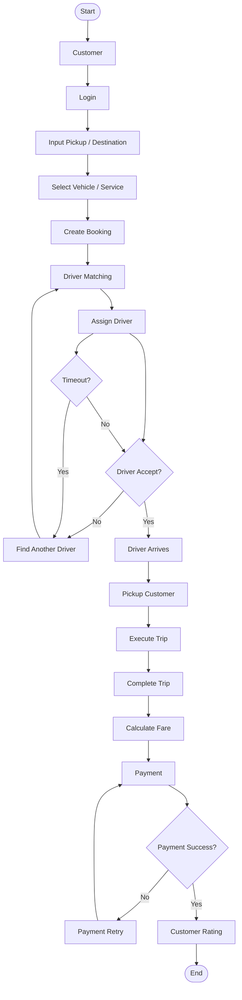

---

# 12. Functional Requirements

## FR-01 - Customer Management

| ID           | Functional Requirement                                      |
| ------------ | ----------------------------------------------------------- |
| **FR-01.01** | Hệ thống phải cho phép Customer đăng ký tài khoản.          |
| **FR-01.02** | Hệ thống phải cho phép Customer đăng nhập.                  |
| **FR-01.03** | Hệ thống phải xác thực thông tin đăng nhập của Customer.    |
| **FR-01.04** | Hệ thống phải cho phép Customer cập nhật thông tin cá nhân. |
| **FR-01.05** | Hệ thống phải cho phép Customer xem thông tin tài khoản.    |
| **FR-01.06** | Hệ thống phải cho phép Customer xem lịch sử Trip.           |
| **FR-01.07** | Hệ thống phải cho phép Customer xem chi tiết từng Trip.     |

---

## FR-02 - Driver & Vehicle Management

| ID           | Functional Requirement                                                   |
| ------------ | ------------------------------------------------------------------------ |
| **FR-02.01** | Hệ thống phải cho phép Operation Staff tạo tài khoản Driver.             |
| **FR-02.02** | Hệ thống phải cho phép Driver đăng nhập.                                 |
| **FR-02.03** | Hệ thống phải cho phép Driver cập nhật thông tin cá nhân.                |
| **FR-02.04** | Hệ thống phải cho phép Driver cập nhật thông tin Vehicle.                |
| **FR-02.05** | Hệ thống phải cho phép Driver chuyển trạng thái `AVAILABLE/UNAVAILABLE`. |
| **FR-02.06** | Hệ thống phải lưu trạng thái hiện tại của Driver.                        |
| **FR-02.07** | Hệ thống phải nhận và lưu Location hiện tại của Driver.                  |
| **FR-02.08** | Operation Staff phải có thể xem thông tin Driver.                        |
| **FR-02.09** | Operation Staff phải có thể xem thông tin Vehicle.                       |

---

## FR-03 - Ride Booking

| ID           | Functional Requirement                                                |
| ------------ | --------------------------------------------------------------------- |
| **FR-03.01** | Hệ thống phải cho phép Customer nhập Pickup Location.                 |
| **FR-03.02** | Hệ thống phải cho phép Customer nhập Destination.                     |
| **FR-03.03** | Hệ thống phải cho phép Customer chọn loại xe/dịch vụ.                 |
| **FR-03.04** | Hệ thống phải kiểm tra tính hợp lệ của thông tin Booking.             |
| **FR-03.05** | Hệ thống phải cho phép Customer gửi Booking Request.                  |
| **FR-03.06** | Hệ thống phải tạo Booking với trạng thái ban đầu phù hợp.             |
| **FR-03.07** | Hệ thống phải tạo mã định danh duy nhất cho mỗi Booking.              |
| **FR-03.08** | Hệ thống phải hiển thị trạng thái Booking cho Customer.               |
| **FR-03.09** | Hệ thống phải cho phép Customer hủy Booking theo Cancellation Policy. |
| **FR-03.10** | Hệ thống phải lưu lịch sử thay đổi trạng thái Booking.                |

---

## FR-04 - Driver Matching & Dispatch

| ID           | Functional Requirement                                                    |
| ------------ | ------------------------------------------------------------------------- |
| **FR-04.01** | Hệ thống phải xác định các Driver đủ điều kiện nhận Booking.              |
| **FR-04.02** | Hệ thống phải xem xét Location hiện tại của Driver.                       |
| **FR-04.03** | Hệ thống phải xem xét trạng thái hoạt động của Driver.                    |
| **FR-04.04** | Hệ thống phải áp dụng tiêu chí ưu tiên Driver theo Matching Policy.       |
| **FR-04.05** | Hệ thống phải gửi Trip Request đến Driver được lựa chọn.                  |
| **FR-04.06** | Hệ thống phải cho phép Driver Accept Trip.                                |
| **FR-04.07** | Hệ thống phải cho phép Driver Reject Trip.                                |
| **FR-04.08** | Hệ thống phải xử lý trường hợp Driver không phản hồi theo Timeout Policy. |
| **FR-04.09** | Hệ thống phải tìm Driver khác khi Driver Reject hoặc Timeout.             |
| **FR-04.10** | Hệ thống phải thông báo cho Customer khi không tìm được Driver.           |

---

## FR-05 - Trip Execution

| ID           | Functional Requirement                                                       |
| ------------ | ---------------------------------------------------------------------------- |
| **FR-05.01** | Hệ thống phải tạo Trip khi Driver được phân công thành công.                 |
| **FR-05.02** | Hệ thống phải quản lý trạng thái của Trip.                                   |
| **FR-05.03** | Driver phải có thể cập nhật trạng thái Trip.                                 |
| **FR-05.04** | Hệ thống phải ghi nhận thời điểm Driver nhận Trip.                           |
| **FR-05.05** | Hệ thống phải ghi nhận trạng thái Driver đang di chuyển đến Pickup Location. |
| **FR-05.06** | Hệ thống phải ghi nhận khi Driver đến Pickup Location.                       |
| **FR-05.07** | Hệ thống phải ghi nhận khi Trip bắt đầu.                                     |
| **FR-05.08** | Hệ thống phải ghi nhận khi Trip hoàn thành.                                  |
| **FR-05.09** | Hệ thống phải lưu lịch sử thay đổi trạng thái Trip.                          |
| **FR-05.10** | Customer phải có thể theo dõi trạng thái Trip.                               |

### 12.5.1. Trip Lifecycle

```text
ASSIGNED
   │
   ▼
ACCEPTED
   │
   ▼
DRIVER_EN_ROUTE
   │
   ▼
DRIVER_ARRIVED
   │
   ▼
IN_PROGRESS
   │
   ▼
COMPLETED
```

> Danh sách trạng thái cuối cùng cần được xác nhận trong Trip Lifecycle Policy.

---

## FR-06 - Driver Location & Tracking

| ID           | Functional Requirement                                                               |
| ------------ | ------------------------------------------------------------------------------------ |
| **FR-06.01** | Hệ thống phải nhận Location từ Driver.                                               |
| **FR-06.02** | Hệ thống phải lưu Location theo chính sách được xác định.                            |
| **FR-06.03** | Hệ thống phải cập nhật Location hiện tại của Driver.                                 |
| **FR-06.04** | Hệ thống phải hỗ trợ sử dụng Location cho Driver Matching.                           |
| **FR-06.05** | Customer phải có thể theo dõi Driver trong phạm vi chức năng được cung cấp.          |
| **FR-06.06** | Operation Staff phải có thể theo dõi Location/Trạng thái Driver theo quyền được cấp. |
| **FR-06.07** | Hệ thống phải tích hợp với Map/GPS Provider.                                         |

---

## FR-07 - Fare Calculation

| ID           | Functional Requirement                                                 |
| ------------ | ---------------------------------------------------------------------- |
| **FR-07.01** | Hệ thống phải xác định Fare của Trip.                                  |
| **FR-07.02** | Hệ thống phải sử dụng Fare Policy để tính cước.                        |
| **FR-07.03** | Hệ thống phải lưu thông tin Fare của Trip.                             |
| **FR-07.04** | Hệ thống phải cung cấp Fare cho Payment Process.                       |
| **FR-07.05** | Customer phải có thể xem Fare theo quyền/chức năng được cung cấp.      |
| **FR-07.06** | Operation Staff phải có thể tra cứu Fare của Trip theo quyền được cấp. |

> Chi tiết công thức Fare, phụ phí, discount và các điều kiện liên quan cần được xác nhận với Business Stakeholder.

---

## FR-08 - Payment

| ID           | Functional Requirement                                                       |
| ------------ | ---------------------------------------------------------------------------- |
| **FR-08.01** | Customer phải có thể lựa chọn phương thức Payment.                           |
| **FR-08.02** | Hệ thống phải hỗ trợ phương thức Cash.                                       |
| **FR-08.03** | Hệ thống phải hỗ trợ Electronic Payment.                                     |
| **FR-08.04** | Hệ thống phải gửi Payment Request đến Payment Provider.                      |
| **FR-08.05** | Hệ thống phải nhận Payment Result từ Payment Provider.                       |
| **FR-08.06** | Hệ thống phải lưu trạng thái Payment.                                        |
| **FR-08.07** | Hệ thống phải thông báo kết quả Payment cho Customer.                        |
| **FR-08.08** | Hệ thống phải hỗ trợ Payment Retry theo Payment Policy.                      |
| **FR-08.09** | Hệ thống không được lưu trực tiếp thông tin thanh toán nhạy cảm.             |
| **FR-08.10** | Operation Staff phải có thể tra cứu Payment Transaction theo quyền được cấp. |

### 12.8.1. Payment Flow

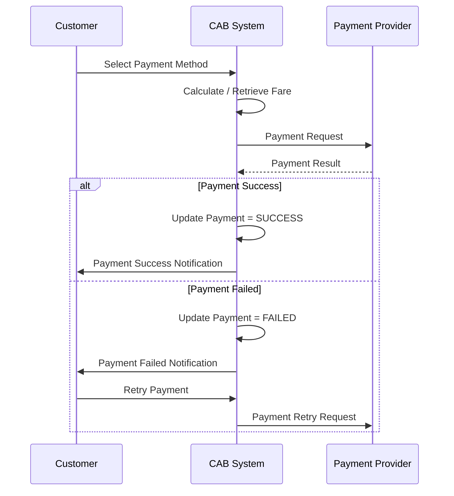

---

## FR-09 - Notification

| ID           | Functional Requirement                                          |
| ------------ | --------------------------------------------------------------- |
| **FR-09.01** | Hệ thống phải gửi Notification khi Booking được tiếp nhận.      |
| **FR-09.02** | Hệ thống phải thông báo khi Driver được gán.                    |
| **FR-09.03** | Hệ thống phải thông báo khi Driver đến Pickup Location.         |
| **FR-09.04** | Hệ thống phải thông báo khi Trip hoàn thành.                    |
| **FR-09.05** | Hệ thống phải thông báo kết quả Payment.                        |
| **FR-09.06** | Hệ thống phải thông báo cho Driver khi có Trip mới.             |
| **FR-09.07** | Hệ thống phải thông báo cho Driver khi Trip có thay đổi.        |
| **FR-09.08** | Hệ thống phải lưu trạng thái gửi Notification.                  |
| **FR-09.09** | Hệ thống phải hỗ trợ thêm Notification Channel trong tương lai. |

### 12.9.1. Notification Model

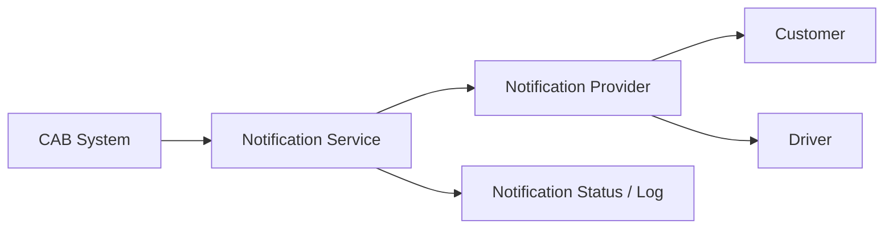

---

## FR-10 - Operation Management

| ID           | Functional Requirement                                                                  |
| ------------ | --------------------------------------------------------------------------------------- |
| **FR-10.01** | Operation Staff phải có thể xem danh sách Driver.                                       |
| **FR-10.02** | Operation Staff phải có thể xem trạng thái Driver.                                      |
| **FR-10.03** | Operation Staff phải có thể xem thông tin Vehicle.                                      |
| **FR-10.04** | Operation Staff phải có thể xem danh sách Booking.                                      |
| **FR-10.05** | Operation Staff phải có thể xem trạng thái Trip.                                        |
| **FR-10.06** | Operation Staff phải có thể tra cứu Payment Transaction theo quyền được cấp.            |
| **FR-10.07** | Operation Staff phải có thể theo dõi các vấn đề vận hành.                               |
| **FR-10.08** | Hệ thống phải hỗ trợ Operation Staff xử lý các trường hợp ngoại lệ theo quyền được cấp. |

---

## FR-11 - Reporting & Analytics

| ID           | Functional Requirement                                         |
| ------------ | -------------------------------------------------------------- |
| **FR-11.01** | Hệ thống phải cung cấp báo cáo về số lượng Trip.               |
| **FR-11.02** | Hệ thống phải cung cấp báo cáo về doanh thu.                   |
| **FR-11.03** | Hệ thống phải cung cấp báo cáo về tỷ lệ hoàn thành Trip.       |
| **FR-11.04** | Hệ thống phải cung cấp báo cáo về tỷ lệ Cancellation.          |
| **FR-11.05** | Hệ thống phải cung cấp báo cáo về hiệu suất Driver.            |
| **FR-11.06** | Hệ thống phải hỗ trợ Dashboard cho các vai trò được cấp quyền. |
| **FR-11.07** | Hệ thống phải hỗ trợ dữ liệu phục vụ Business Decision Making. |

---

## FR-12 - Security, Role & Audit

| ID           | Functional Requirement                                                               |
| ------------ | ------------------------------------------------------------------------------------ |
| **FR-12.01** | Hệ thống phải xác thực User trước khi truy cập các chức năng yêu cầu Authentication. |
| **FR-12.02** | Hệ thống phải hỗ trợ phân quyền theo Role.                                           |
| **FR-12.03** | Hệ thống phải kiểm soát quyền truy cập vào dữ liệu.                                  |
| **FR-12.04** | Hệ thống phải lưu Audit Log đối với các thao tác quan trọng.                         |
| **FR-12.05** | Hệ thống phải ghi nhận User thực hiện thao tác.                                      |
| **FR-12.06** | Hệ thống phải ghi nhận thời điểm thực hiện thao tác.                                 |
| **FR-12.07** | Hệ thống phải bảo vệ các dữ liệu nhạy cảm.                                           |
| **FR-12.08** | Operation Staff chỉ được truy cập Payment/Customer/Driver data theo quyền được cấp.  |

---

# 13. Tổng quan Functional Requirement

```mermaid
flowchart TB
    CAB["CAB SYSTEM"]

    FR01["FR-01<br/>Customer Management"]
    FR02["FR-02<br/>Driver & Vehicle"]
    FR03["FR-03<br/>Ride Booking"]
    FR04["FR-04<br/>Driver Matching & Dispatch"]
    FR05["FR-05<br/>Trip Execution"]
    FR06["FR-06<br/>Location & Tracking"]
    FR07["FR-07<br/>Fare Calculation"]
    FR08["FR-08<br/>Payment"]
    FR09["FR-09<br/>Notification"]
    FR10["FR-10<br/>Operation Management"]
    FR11["FR-11<br/>Reporting & Analytics"]
    FR12["FR-12<br/>Security & Audit"]

    CAB --> FR01
    CAB --> FR02
    CAB --> FR03
    CAB --> FR04
    CAB --> FR05
    CAB --> FR06
    CAB --> FR07
    CAB --> FR08
    CAB --> FR09
    CAB --> FR10
    CAB --> FR11
    CAB --> FR12
```

---

# 14. End-to-End Business Flow

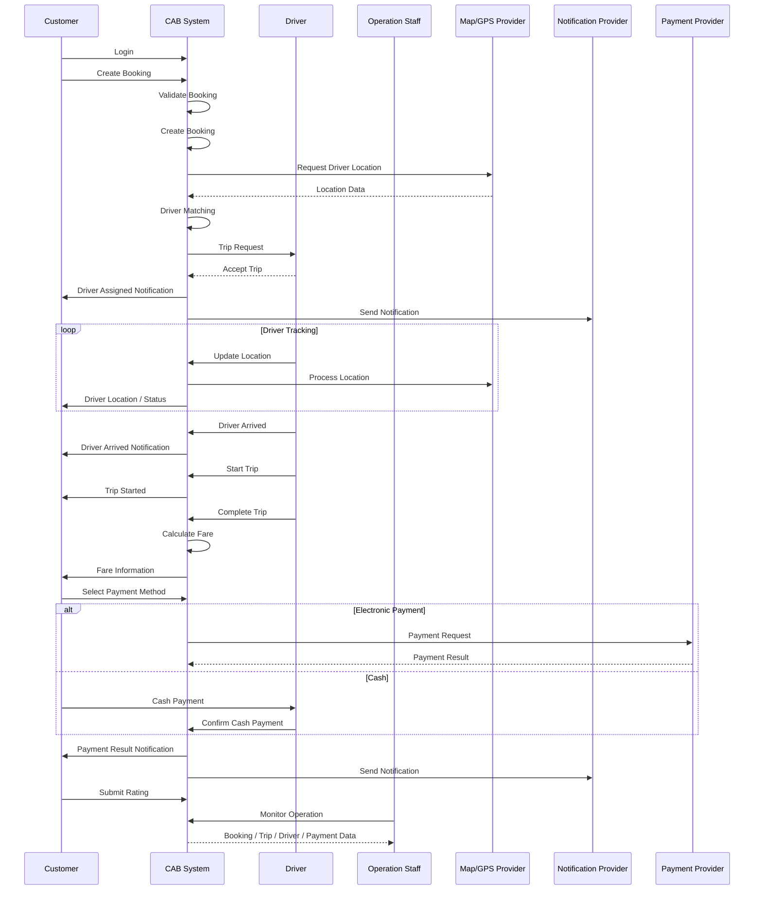

---

# 15. Traceability Overview

Mối quan hệ giữa Business Goals, Business Requirements, Business Processes và Functional Requirements có thể được mô hình hóa như sau:

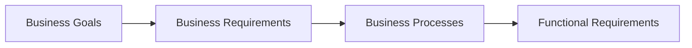

## 15.1. Business Goal → Business Requirement

| Business Goal                            | Business Requirements liên quan |
| ---------------------------------------- | ------------------------------- |
| **BG1 - Tự động hóa Booking & Dispatch** | BR-03, BR-04                    |
| **BG2 - Customer Experience**            | BR-01, BR-03                    |
| **BG3 - Driver Efficiency**              | BR-02, BR-04                    |
| **BG4 - Centralized Management**         | BR-01, BR-02, BR-08             |
| **BG5 - Scalability**                    | Toàn bộ hệ thống                |
| **BG6 - Reliability & Resilience**       | BR-04, BR-06, BR-08             |
| **BG7 - Future Extensibility**           | BR-04, BR-06, BR-08             |
| **BG8 - Data-driven Management**         | BR-08, BR-09                    |
| **BG9 - Security & Control**             | BR-10                           |

---

# 16. Actor Overview

| Actor                     | Vai trò                                            |
| ------------------------- | -------------------------------------------------- |
| **Customer**              | Tạo Booking, theo dõi Trip, Payment và Rating      |
| **Driver**                | Nhận Trip, cập nhật Location và thực hiện Trip     |
| **Operation Staff**       | Quản lý và giám sát hoạt động vận hành             |
| **Management**            | Theo dõi Dashboard và Report, hỗ trợ ra quyết định |
| **Payment Provider**      | Xử lý Electronic Payment                           |
| **Notification Provider** | Cung cấp dịch vụ Notification                      |
| **Map/GPS Provider**      | Cung cấp Map và Location/GPS services              |

---

# 17. Tổng quan hệ thống

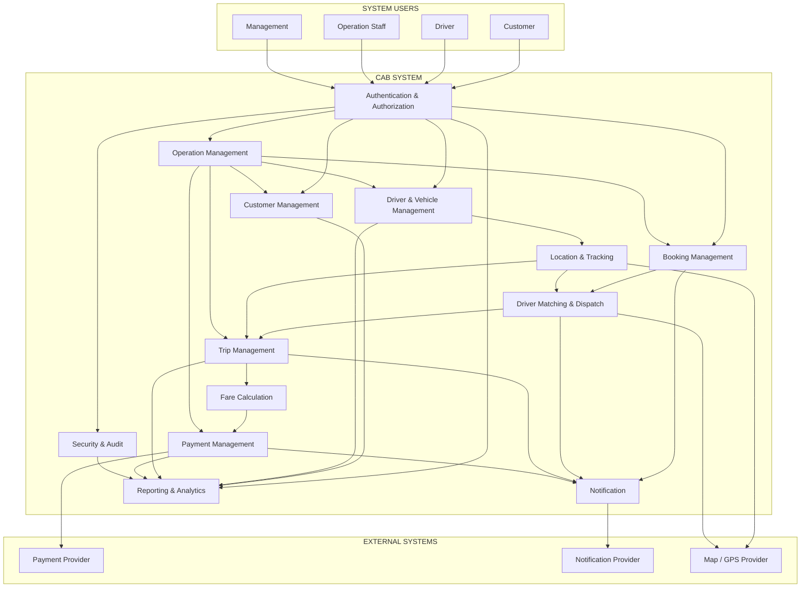

---

# 18. Các nội dung cần xác nhận trước khi Baseline

Các nội dung dưới đây hiện mới được xác định ở mức Business/Functional Requirement và cần được làm rõ trước khi chuyển sang Detailed Requirement hoặc Solution Design.

## 18.1. Driver Matching

Cần xác nhận:

* Tiêu chí lựa chọn Driver.
* Khoảng cách tối đa.
* Driver Priority.
* Driver Rating có ảnh hưởng đến Matching hay không.
* Driver đang thực hiện Trip có được đưa vào Matching hay không.
* Số lần Retry.
* Timeout cho mỗi Driver.
* Thời gian tối đa cho toàn bộ Matching Process.

## 18.2. Fare

Cần xác nhận:

* Công thức tính Fare.
* Base Fare.
* Distance Fare.
* Time Fare.
* Minimum Fare.
* Surge Pricing.
* Additional Fee.
* Discount/Promotion.
* Rounding Rule.
* Fare khi Trip bị Cancel.

## 18.3. Cancellation

Cần xác nhận:

* Ai được phép Cancel.
* Khi nào Customer được Cancel.
* Khi nào Driver được Cancel.
* Cancellation Fee.
* Trường hợp Driver Cancel.
* Trường hợp Customer Cancel.
* Trường hợp System không tìm được Driver.

## 18.4. Payment

Cần xác nhận:

* Payment Method.
* Payment Timeout.
* Payment Retry.
* Maximum Retry Count.
* Payment Callback/Webhook.
* Reconciliation.
* Refund.
* Partial Refund.
* Cash Confirmation.
* Payment Failure Handling.

## 18.5. Location & Tracking

Cần xác nhận:

* Tần suất gửi Location.
* Độ chính xác Location.
* Thời gian lưu Location History.
* Khi nào bắt đầu Tracking.
* Khi nào dừng Tracking.
* Quyền truy cập Location.
* Xử lý khi mất Network.

## 18.6. Notification

Cần xác nhận:

* Notification Channel.
* Push Notification.
* SMS.
* Email.
* In-app Notification.
* Retry Policy.
* Notification Template.
* Notification Priority.
* Notification Delivery Status.

## 18.7. Data Retention

Cần xác nhận thời gian lưu:

* Customer Data.
* Driver Data.
* Vehicle Data.
* Booking History.
* Trip History.
* Location History.
* Payment Transaction.
* Notification Log.
* Audit Log.

---

# 19. Phân biệt các mức Requirement

Để tránh trộn lẫn các mức yêu cầu trong các bước phân tích tiếp theo, CAB System có thể sử dụng cấu trúc:

```text
Business Goal
      │
      ▼
Business Requirement
      │
      ▼
Business Process
      │
      ▼
Functional Requirement
      │
      ▼
Detailed Requirement
      │
      ▼
Solution / System Design
```

### Business Goal

Mô tả **doanh nghiệp muốn đạt được điều gì**.

Ví dụ:

> BG1 - Tự động hóa Booking & Driver Dispatch.

### Business Requirement

Mô tả **doanh nghiệp cần hệ thống hỗ trợ nghiệp vụ gì**.

Ví dụ:

> BR-04 - Driver Matching & Dispatch.

### Business Process

Mô tả **nghiệp vụ được thực hiện như thế nào ở mức tổng quan**.

Ví dụ:

> BP-04 - Driver Matching & Dispatch.

### Functional Requirement

Mô tả **hệ thống phải cung cấp chức năng gì**.

Ví dụ:

> FR-04.06 - Hệ thống phải cho phép Driver Accept Trip.

### Detailed Requirement

Sẽ mô tả chi tiết hơn về:

* Input.
* Output.
* Business Rules.
* Validation.
* Error Handling.
* Exception Handling.
* State Transition.
* Permission.
* Integration.
* Data.
* API behavior.

---

# 20. Kết luận

CAB System là nền tảng trung tâm phục vụ toàn bộ quy trình kinh doanh đặt xe của ABC.

Phạm vi chính của hệ thống bao gồm:

1. **Customer Management**
2. **Driver & Vehicle Management**
3. **Ride Booking**
4. **Driver Matching & Dispatch**
5. **Trip Execution**
6. **Location & Tracking**
7. **Fare Calculation**
8. **Payment**
9. **Notification**
10. **Operation Management**
11. **Reporting & Analytics**
12. **Security & Audit**

Kiến trúc nghiệp vụ được định hướng theo nguyên tắc:

```text
Customer
    │
    ▼
Booking
    │
    ▼
Driver Matching
    │
    ▼
Trip
    │
    ├──────────────► Location / Tracking
    │
    ├──────────────► Notification
    │
    ▼
Fare Calculation
    │
    ▼
Payment
    │
    ▼
Rating

Song song:

Operation Management
        │
        ├── Monitoring
        ├── Support
        ├── Reporting
        └── Audit
```
# 21. Customer Business Rules

## BR-CUS-001 - Customer phải có tài khoản hợp lệ

**Rule:**

Customer phải có tài khoản hợp lệ và được xác thực trước khi sử dụng các chức năng yêu cầu Authentication.

Đặc biệt, Customer phải được Authentication trước khi tạo Booking.

**Status:** `Confirmed`

---

## BR-CUS-002 - Customer chỉ được cập nhật thông tin của chính mình

**Rule:**

Customer chỉ được phép cập nhật thông tin thuộc tài khoản của chính mình.

Customer không được phép cập nhật thông tin của Customer khác.

**Status:** `Confirmed`

---

## BR-CUS-003 - Customer chỉ được xem dữ liệu của chính mình

**Rule:**

Customer chỉ được phép xem:

* Account Information của chính mình.
* Booking của chính mình.
* Trip của chính mình.
* Payment của chính mình.
* Rating của chính mình.

**Status:** `Confirmed`

---

## BR-CUS-004 - Customer phải Authentication trước khi tạo Booking

**Rule:**

Booking phải được tạo bởi một Customer đã được Authentication thành công.

**Status:** `Confirmed`

---

## BR-CUS-005 - Customer phải cung cấp dữ liệu bắt buộc

Customer phải cung cấp đầy đủ các thông tin bắt buộc trước khi tạo Booking.

Bao gồm tối thiểu:

* Pickup Location.
* Destination.
* Vehicle/Service Type.

**Status:** `Confirmed`

---

# 22. Customer Exceptions

## EX-CUS-001 - Invalid Login

**Condition:**

Customer cung cấp thông tin đăng nhập không hợp lệ.

**System Behavior:**

* Từ chối Login.
* Không tạo Session.
* Thông báo lỗi phù hợp.
* Có thể ghi Security Log theo Security Policy.

**Status:** `Confirmed`

---

## EX-CUS-002 - Customer Account Not Found

**Condition:**

Không tìm thấy Customer Account.

**System Behavior:**

* Từ chối Authentication.
* Không cho phép truy cập các chức năng yêu cầu Authentication.

**Status:** `Confirmed`

---

## EX-CUS-003 - Customer Account Inactive

**Condition:**

Customer Account đang ở trạng thái inactive/blocked.

**System Behavior:**

* Từ chối Login.
* Không cho phép sử dụng các chức năng yêu cầu Account Active.

**Status:** `To Be Confirmed`

---

## EX-CUS-004 - Unauthorized Customer Access

**Condition:**

Customer cố gắng truy cập dữ liệu không thuộc quyền của mình.

**System Behavior:**

* Từ chối Request.
* Không trả về dữ liệu không được phép.
* Ghi Audit/Security Log.

**Status:** `Confirmed`

---

## EX-CUS-005 - Invalid Customer Data

**Condition:**

Customer gửi dữ liệu không hợp lệ khi cập nhật thông tin.

**System Behavior:**

* Từ chối Update.
* Trả về Validation Error.
* Không lưu dữ liệu không hợp lệ.

**Status:** `Confirmed`

---

# 23. Driver & Vehicle Business Rules

## BR-DRV-001 - Driver phải có tài khoản hợp lệ

Driver phải có tài khoản hợp lệ để Login và thực hiện các chức năng liên quan đến Trip.

**Status:** `Confirmed`

---

## BR-DRV-002 - Driver phải có Vehicle phù hợp

Driver phải được liên kết với Vehicle phù hợp trước khi được đưa vào Matching.

**Status:** `To Be Confirmed`

---

## BR-DRV-003 - Chỉ Driver AVAILABLE mới được Matching

Driver chỉ được đưa vào Matching Pool khi Driver ở trạng thái:

```text
AVAILABLE
```

Driver ở trạng thái:

```text
UNAVAILABLE
```

không được nhận Booking mới.

**Status:** `Confirmed`

---

## BR-DRV-004 - Driver đang thực hiện Trip không được nhận Trip mới

Driver đang có Trip Active không được nhận Trip khác nếu Business không cho phép Multiple Active Trips.

**Status:** `To Be Confirmed`

---

## BR-DRV-005 - Driver phải cung cấp Location

Driver phải cung cấp Location để hệ thống có thể:

* Driver Matching.
* Tracking.
* Operation Monitoring.

**Status:** `Confirmed`

---

## BR-DRV-006 - Driver phải phù hợp với Vehicle/Service Type

Driver chỉ được nhận Booking nếu Vehicle của Driver đáp ứng Vehicle/Service Type mà Customer yêu cầu.

**Status:** `To Be Confirmed`

---

## BR-DRV-007 - Operation Staff có quyền quản lý Driver

Operation Staff có thể xem và quản lý Driver theo Role/Permission được cấp.

**Status:** `Confirmed`

---

# 24. Driver & Vehicle Exceptions

## EX-DRV-001 - Driver Account Invalid

**Condition:**

Driver Account không tồn tại, inactive hoặc không hợp lệ.

**System Behavior:**

* Không cho Driver thực hiện các thao tác yêu cầu Authentication.
* Không đưa Driver vào Matching.

**Status:** `Confirmed`

---

## EX-DRV-002 - Vehicle Not Available

**Condition:**

Driver không có Vehicle phù hợp hoặc Vehicle không available.

**System Behavior:**

* Driver không được đưa vào Matching.
* Thông báo lý do phù hợp nếu cần.

**Status:** `To Be Confirmed`

---

## EX-DRV-003 - Vehicle Inactive

**Condition:**

Vehicle của Driver không còn Active.

**System Behavior:**

Driver không được nhận Booking mới.

**Status:** `To Be Confirmed`

---

## EX-DRV-004 - Driver Becomes UNAVAILABLE

**Condition:**

Driver chuyển từ `AVAILABLE` sang `UNAVAILABLE` trong quá trình Matching.

**System Behavior:**

* Driver bị loại khỏi Matching Pool.
* Trip Request chưa được Accept phải được xử lý theo Matching Policy.

**Status:** `To Be Confirmed`

---

## EX-DRV-005 - Driver Already Has Active Trip

**Condition:**

Driver đang thực hiện Trip khác.

**System Behavior:**

Driver không được đưa vào Matching cho Booking mới.

**Status:** `To Be Confirmed`

---

## EX-DRV-006 - Invalid Driver Location

**Condition:**

Driver gửi Location không hợp lệ.

Ví dụ:

* Latitude không hợp lệ.
* Longitude không hợp lệ.
* Timestamp không hợp lệ.

**System Behavior:**

* Reject Location Update.
* Không sử dụng Location không hợp lệ cho Matching.

**Status:** `Confirmed`

---

## EX-DRV-007 - Driver Location Stale

**Condition:**

Driver không cập nhật Location trong khoảng thời gian được quy định.

**System Behavior:**

* Đánh dấu Location là `STALE`.
* Không sử dụng Location stale cho Matching nếu Policy không cho phép.
* Có thể cảnh báo Operation Staff.

**Status:** `To Be Confirmed`

---

# 25. Booking Business Rules

## BR-BKG-001 - Booking phải thuộc về một Customer

Mỗi Booking phải thuộc về đúng một Customer.

```text
Customer 1 ──────── N Booking
```

**Status:** `Confirmed`

---

## BR-BKG-002 - Booking phải có Pickup Location

Booking hợp lệ phải có Pickup Location.

**Status:** `Confirmed`

---

## BR-BKG-003 - Booking phải có Destination

Booking hợp lệ phải có Destination.

**Status:** `Confirmed`

---

## BR-BKG-004 - Booking phải có Vehicle/Service Type

Customer phải chọn Vehicle/Service Type trước khi tạo Booking.

**Status:** `Confirmed`

---

## BR-BKG-005 - Booking phải có Unique Identifier

Mỗi Booking phải có một Identifier duy nhất.

**Status:** `Confirmed`

---

## BR-BKG-006 - Booking phải có Lifecycle State

Booking phải được quản lý thông qua một tập hợp trạng thái được định nghĩa trước.

Ví dụ:

```text
CREATED
   │
   ▼
SEARCHING_DRIVER
   │
   ▼
DRIVER_ASSIGNED
   │
   ▼
IN_PROGRESS
   │
   ▼
COMPLETED
```

Các trạng thái kết thúc có thể bao gồm:

```text
CANCELLED
NO_DRIVER_FOUND
```

**Status:** `To Be Confirmed`

---

## BR-BKG-007 - Booking phải lưu State History

Mỗi thay đổi trạng thái Booking phải được lưu để phục vụ:

* Tracking.
* Audit.
* Operation.
* Reporting.

**Status:** `Confirmed`

---

## BR-BKG-008 - Customer chỉ được Cancel Booking theo Cancellation Policy

Customer chỉ được Cancel Booking khi trạng thái hiện tại cho phép Cancel.

**Status:** `Confirmed`

---

## BR-BKG-009 - Matching Failure không yêu cầu Customer tạo Booking mới

Nếu Driver Reject hoặc Timeout, hệ thống phải tiếp tục Matching cho cùng Booking.

Customer không cần tạo Booking mới.

**Status:** `Confirmed`

---

# 26. Booking Exceptions

## EX-BKG-001 - Missing Pickup Location

**Condition:**

Pickup Location bị thiếu.

**System Behavior:**

* Reject Booking.
* Trả Validation Error.
* Không tạo Booking.

**Status:** `Confirmed`

---

## EX-BKG-002 - Missing Destination

**Condition:**

Destination bị thiếu.

**System Behavior:**

* Reject Booking.
* Trả Validation Error.
* Không tạo Booking.

**Status:** `Confirmed`

---

## EX-BKG-003 - Invalid Vehicle/Service Type

**Condition:**

Vehicle/Service Type không tồn tại hoặc không available.

**System Behavior:**

* Reject Booking.
* Yêu cầu Customer chọn Service Type khác.

**Status:** `Confirmed`

---

## EX-BKG-004 - Service Area Not Supported

**Condition:**

Pickup hoặc Destination nằm ngoài khu vực CAB hỗ trợ.

**System Behavior:**

* Không tạo Booking.
* Thông báo Service Area không được hỗ trợ.

**Status:** `To Be Confirmed`

---

## EX-BKG-005 - Duplicate Booking

**Condition:**

Customer gửi nhiều Booking giống nhau trong một khoảng thời gian ngắn.

**System Behavior:**

Hệ thống có thể:

* Từ chối Booking duplicate.
* Hoặc trả về Booking đang tồn tại.

Tiêu chí xác định Duplicate Booking cần được Business xác nhận.

**Status:** `To Be Confirmed`

---

## EX-BKG-006 - Booking Creation Failure

**Condition:**

System Failure xảy ra trong quá trình tạo Booking.

**System Behavior:**

* Không để Booking ở trạng thái không xác định.
* Rollback hoặc đảm bảo Transaction Consistency.
* Trả lỗi cho Customer.
* Ghi Log.

**Status:** `Confirmed`

---

## EX-BKG-007 - Cancellation Not Allowed

**Condition:**

Customer yêu cầu Cancel nhưng Booking đang ở trạng thái không cho phép Cancel.

Ví dụ:

```text
IN_PROGRESS
COMPLETED
```

**System Behavior:**

* Reject Cancellation.
* Giữ nguyên Booking State.
* Thông báo Customer.

**Status:** `To Be Confirmed`

---

# 27. Driver Matching & Dispatch Business Rules

## BR-MAT-001 - Chỉ Driver đủ điều kiện mới được Matching

Driver phải đáp ứng tất cả các điều kiện Matching bắt buộc.

Ví dụ:

```text
Driver Active
AND
Driver AVAILABLE
AND
Vehicle phù hợp
AND
Location hợp lệ
AND
Không có Active Trip
```

**Status:** `To Be Confirmed`

---

## BR-MAT-002 - Matching phải xét Vehicle/Service Type

Driver phải có Vehicle phù hợp với Booking.

**Status:** `To Be Confirmed`

---

## BR-MAT-003 - Matching phải xét Driver Location

Location của Driver phải được xem xét trong quá trình Matching.

**Status:** `Confirmed`

---

## BR-MAT-004 - Driver UNAVAILABLE không được Matching

Driver `UNAVAILABLE` không được đưa vào Matching Pool.

**Status:** `Confirmed`

---

## BR-MAT-005 - Matching phải áp dụng Driver Priority

Nếu có nhiều Driver đủ điều kiện, hệ thống phải áp dụng Driver Priority Policy.

Ví dụ các tiêu chí có thể bao gồm:

* Distance.
* Availability.
* Driver Priority.
* Vehicle Type.
* Các tiêu chí Business khác.

**Status:** `To Be Confirmed`

---

## BR-MAT-006 - Một Booking chỉ có một Driver Assignment tại một thời điểm

Một Booking không được đồng thời Assignment cho nhiều Driver.

```text
Booking
   │
   └── Driver A
```

Không được:

```text
Booking
   ├── Driver A
   └── Driver B
```

**Status:** `Confirmed`

---

## BR-MAT-007 - Assignment chỉ thành công khi Driver Accept

Việc gửi Trip Request cho Driver không đồng nghĩa Driver đã được Assignment.

Assignment chỉ được xác nhận khi Driver Accept thành công.

**Status:** `Confirmed`

---

## BR-MAT-008 - Driver Reject phải kích hoạt Matching tiếp theo

Nếu Driver Reject Trip:

```text
Driver A
   │
   └── REJECT
          │
          ▼
    Find Driver B
```

Customer không cần tạo Booking mới.

**Status:** `Confirmed`

---

## BR-MAT-009 - Driver Timeout phải được xử lý

Nếu Driver không phản hồi trong Timeout Period, hệ thống phải xử lý theo Timeout Policy.

**Status:** `Confirmed`

---

## BR-MAT-010 - Matching phải dừng khi Driver Accept thành công

Khi một Driver Accept Booking thành công, hệ thống phải dừng việc tìm Driver khác cho Booking đó.

**Status:** `Confirmed`

---

## BR-MAT-011 - Matching Failure phải thông báo Customer

Nếu không tìm được Driver phù hợp, hệ thống phải thông báo Customer.

**Status:** `Confirmed`

---

# 28. Driver Matching Exceptions

## EX-MAT-001 - No Eligible Driver

**Condition:**

Không có Driver nào đáp ứng Matching Criteria.

**System Behavior:**

* Dừng Matching theo Retry/Timeout Policy.
* Chuyển Booking sang trạng thái phù hợp.
* Thông báo Customer.
* Có thể thông báo Operation Staff.

**Status:** `Confirmed`

---

## EX-MAT-002 - Driver Reject

**Condition:**

Driver được chọn Reject Trip.

**System Behavior:**

* Loại Driver khỏi lần Matching hiện tại.
* Tìm Driver tiếp theo.
* Không yêu cầu Customer tạo Booking mới.

**Status:** `Confirmed`

---

## EX-MAT-003 - Driver Timeout

**Condition:**

Driver không phản hồi trong thời gian quy định.

**System Behavior:**

* Xem Driver như No Response.
* Tiếp tục Matching Driver khác.
* Ghi nhận Timeout Event.

**Status:** `Confirmed`

---

## EX-MAT-004 - Driver Becomes Unavailable During Matching

**Condition:**

Driver chuyển sang `UNAVAILABLE` trước khi Accept.

**System Behavior:**

* Không Assignment Driver.
* Loại Driver khỏi Matching.
* Tìm Driver khác.

**Status:** `To Be Confirmed`

---

## EX-MAT-005 - Driver Location Stale

**Condition:**

Driver Location quá cũ.

**System Behavior:**

* Không sử dụng Location stale hoặc giảm Priority theo Location Policy.
* Tìm Driver khác nếu cần.

**Status:** `To Be Confirmed`

---

## EX-MAT-006 - Matching Service Failure

**Condition:**

Matching Service không hoạt động.

**System Behavior:**

```text
Matching Error
      │
      ▼
Retry
      │
      ├── Success → Continue Matching
      │
      └── Failed → Operation Handling
```

Booking không được bị treo vô thời hạn.

**Status:** `To Be Confirmed`

---

## EX-MAT-007 - Concurrent Driver Acceptance

**Condition:**

Hai hoặc nhiều Driver cùng Accept một Booking gần như đồng thời.

**System Behavior:**

* Chỉ một Driver được Assignment.
* Các Driver còn lại nhận kết quả `TRIP_ALREADY_ASSIGNED`.
* Booking không được tạo nhiều Assignment.

**Status:** `Confirmed`

---

# 29. Trip Business Rules

## BR-TRP-001 - Trip chỉ được tạo khi Driver được Assignment

Trip chỉ được tạo/activate sau khi Driver Assignment thành công.

**Status:** `Confirmed`

---

## BR-TRP-002 - Trip phải tuân theo Lifecycle

Trip phải chuyển trạng thái theo các transition hợp lệ.

Ví dụ:

```text
ASSIGNED
    │
    ▼
ACCEPTED
    │
    ▼
DRIVER_EN_ROUTE
    │
    ▼
DRIVER_ARRIVED
    │
    ▼
IN_PROGRESS
    │
    ▼
COMPLETED
```

**Status:** `To Be Confirmed`

---

## BR-TRP-003 - Trip không được bỏ qua State bắt buộc

Không được thực hiện các transition không hợp lệ.

Ví dụ:

```text
ASSIGNED → COMPLETED
```

nếu Business yêu cầu phải trải qua các state trung gian.

**Status:** `To Be Confirmed`

---

## BR-TRP-004 - Completed Trip là trạng thái kết thúc

Trip ở trạng thái `COMPLETED` không được quay lại trạng thái Active trong normal flow.

**Status:** `To Be Confirmed`

---

## BR-TRP-005 - Fare được tính sau khi Trip hoàn thành

```text
Trip Completed
      ↓
Fare Calculation
      ↓
Payment
```

**Status:** `Confirmed`

---

## BR-TRP-006 - Customer được theo dõi Trip của chính mình

Customer có thể xem trạng thái Trip thuộc về mình.

**Status:** `Confirmed`

---

## BR-TRP-007 - Driver chỉ được cập nhật Trip được Assignment

Driver không được thao tác trên Trip của Driver khác.

**Status:** `Confirmed`

---

# 30. Trip Exceptions

## EX-TRP-001 - Invalid State Transition

**Condition:**

Driver hoặc System yêu cầu chuyển Trip sang State không hợp lệ.

**System Behavior:**

* Reject Transition.
* Không thay đổi Trip State.
* Ghi Log.

**Status:** `Confirmed`

---

## EX-TRP-002 - Driver Arrived Without Assignment

**Condition:**

Driver gửi `ARRIVED` nhưng không phải Driver được Assignment.

**System Behavior:**

* Reject Update.
* Không thay đổi Trip State.
* Ghi Audit Log.

**Status:** `Confirmed`

---

## EX-TRP-003 - Start Trip Without Valid Pickup

**Condition:**

Driver cố Start Trip nhưng điều kiện Pickup chưa được thỏa mãn.

**System Behavior:**

* Reject Start Trip.
* Thông báo Driver.
* Operation có thể được cảnh báo.

Các điều kiện Pickup cần Business xác nhận.

**Status:** `To Be Confirmed`

---

## EX-TRP-004 - Trip Completion Failure

**Condition:**

Driver Complete Trip nhưng hệ thống không thể lưu Completion State.

**System Behavior:**

* Retry.
* Không tạo Fare nhiều lần.
* Đảm bảo Trip cuối cùng chỉ có một Completion Result.

**Status:** `To Be Confirmed`

---

## EX-TRP-005 - Driver Disconnect During Trip

**Condition:**

Driver mất Network trong khi Trip đang `IN_PROGRESS`.

**System Behavior:**

* Trip vẫn giữ trạng thái Active.
* Không tự động Cancel chỉ vì mất Network.
* Tiếp tục nhận dữ liệu khi Driver reconnect.
* Operation được cảnh báo nếu vượt Offline Threshold.

**Status:** `To Be Confirmed`

---

# 31. Location & Tracking Business Rules

## BR-LOC-001 - Location phải thuộc về Driver

Mỗi Location Record phải xác định Driver tương ứng.

**Status:** `Confirmed`

---

## BR-LOC-002 - Location phải có Timestamp

Location Record phải chứa thời điểm Location được ghi nhận.

**Status:** `Confirmed`

---

## BR-LOC-003 - Current Location phải là Location mới nhất hợp lệ

Location mới chỉ được cập nhật Current Location nếu hợp lệ và không cũ hơn Location hiện tại.

**Status:** `To Be Confirmed`

---

## BR-LOC-004 - Location được sử dụng cho Matching

Current Driver Location được sử dụng làm một trong các dữ liệu đầu vào của Driver Matching.

**Status:** `Confirmed`

---

## BR-LOC-005 - Location History phải tuân theo Data Retention Policy

Location History phải được lưu và xóa theo Data Retention Policy.

**Status:** `To Be Confirmed`

---

# 32. Location Exceptions

## EX-LOC-001 - GPS Unavailable

**Condition:**

Driver không lấy được GPS.

**System Behavior:**

* Không cập nhật Location mới.
* Giữ Last Known Location.
* Đánh dấu Location là `STALE` nếu vượt Threshold.

**Status:** `To Be Confirmed`

---

## EX-LOC-002 - Invalid GPS Data

**Condition:**

Latitude/Longitude/Timestamp không hợp lệ.

**System Behavior:**

* Reject Location Update.
* Không sử dụng dữ liệu đó cho Matching.

**Status:** `Confirmed`

---

## EX-LOC-003 - Map/GPS Provider Unavailable

**Condition:**

Map/GPS Provider không phản hồi.

**System Behavior:**

* Retry theo Integration Policy.
* Không làm mất Booking/Trip.
* Operation có thể nhận Alert.

**Status:** `To Be Confirmed`

---

## EX-LOC-004 - Out-of-Order Location

**Condition:**

Location mới nhận có Timestamp cũ hơn Current Location.

Ví dụ:

```text
Current Location
Timestamp = 10:05

Incoming Location
Timestamp = 10:03
```

**System Behavior:**

Không ghi đè Current Location bằng dữ liệu cũ.

**Status:** `Confirmed`

---

# 33. Fare Business Rules

## BR-FAR-001 - Completed Trip phải có Fare

Mỗi Trip hoàn thành phải có Fare tương ứng.

**Status:** `Confirmed`

---

## BR-FAR-002 - Fare phải tuân theo Fare Policy

Fare phải được tính theo Fare Policy được Business phê duyệt.

Fare Policy có thể bao gồm:

* Base Fare.
* Distance Fare.
* Time Fare.
* Additional Fee.
* Discount.
* Promotion.
* Minimum Fare.

**Status:** `To Be Confirmed`

---

## BR-FAR-003 - Payment Amount phải dựa trên Fare

Payment Amount phải được xác định từ Fare của Trip.

**Status:** `Confirmed`

---

## BR-FAR-004 - Fare phải thuộc về Trip

Mỗi Fare phải xác định được Trip tương ứng.

**Status:** `Confirmed`

---

## BR-FAR-005 - Fare phải có Currency

Fare phải xác định Currency được sử dụng.

**Status:** `To Be Confirmed`

---

# 34. Fare Exceptions

## EX-FAR-001 - Fare Calculation Failure

**Condition:**

Hệ thống không thể tính Fare.

**System Behavior:**

* Không tạo Payment Request.
* Retry Fare Calculation.
* Nếu Retry thất bại, chuyển sang Exception Handling.
* Operation được cảnh báo nếu cần.

**Status:** `To Be Confirmed`

---

## EX-FAR-002 - Fare Policy Not Found

**Condition:**

Không tìm thấy Fare Policy phù hợp.

**System Behavior:**

* Không tạo Payment.
* Đưa Trip vào trạng thái Exception/Pending Fare.
* Operation được cảnh báo.

**Status:** `To Be Confirmed`

---

## EX-FAR-003 - Invalid Fare Result

**Condition:**

Fare Result không hợp lệ.

Ví dụ:

```text
null
negative amount
invalid currency
```

**System Behavior:**

* Reject Fare.
* Không tạo Payment.
* Ghi Error Log.

**Status:** `Confirmed`

---

## EX-FAR-004 - Duplicate Fare Calculation

**Condition:**

Fare Calculation được gọi nhiều lần cho cùng một Trip.

**System Behavior:**

* Không tạo nhiều Final Fare.
* Sử dụng Idempotency hoặc Existing Fare.
* Đảm bảo Payment sử dụng đúng Fare.

**Status:** `To Be Confirmed`

---

# 35. Payment Business Rules

## BR-PAY-001 - Payment phải thuộc về Trip

Mỗi Payment Transaction phải xác định Trip tương ứng.

**Status:** `Confirmed`

---

## BR-PAY-002 - Payment Amount phải dựa trên Fare

Payment Amount phải phù hợp với Fare của Trip.

**Status:** `Confirmed`

---

## BR-PAY-003 - Customer phải chọn Payment Method

Customer phải chọn Payment Method trước khi thực hiện Payment.

**Status:** `Confirmed`

---

## BR-PAY-004 - Cash Payment và Electronic Payment có Flow khác nhau

```text
Cash
  │
  ▼
Cash Confirmation

Electronic Payment
  │
  ▼
Payment Provider
  │
  ▼
Payment Result
```

**Status:** `Confirmed`

---

## BR-PAY-005 - Electronic Payment phải thông qua Payment Provider

CAB System phải sử dụng Payment Provider để xử lý Electronic Payment.

**Status:** `Confirmed`

---

## BR-PAY-006 - Không lưu Payment Sensitive Data trực tiếp

CAB System không được lưu trực tiếp thông tin Payment nhạy cảm.

**Status:** `Confirmed`

---

## BR-PAY-007 - Payment phải có Lifecycle State

Payment phải có trạng thái.

Ví dụ:

```text
PENDING
   │
   ├── SUCCESS
   │
   └── FAILED
```

Các state khác như `REFUNDED`, `CANCELLED`, `RETRYING` cần được xác nhận.

**Status:** `Confirmed`

---

## BR-PAY-008 - Payment Failure không tự động làm Trip Failed

Trip đã hoàn thành vẫn giữ trạng thái `COMPLETED` nếu Payment thất bại.

Payment được xử lý độc lập.

**Status:** `To Be Confirmed`

---

## BR-PAY-009 - Payment Retry phải tuân theo Payment Policy

Payment Retry phải tuân theo:

* Retry Count.
* Retry Interval.
* Retryable Error.
* Non-Retryable Error.

**Status:** `To Be Confirmed`

---

# 36. Payment Exceptions

## EX-PAY-001 - Payment Provider Timeout

**Condition:**

CAB gửi Payment Request nhưng không nhận Response trong Timeout Period.

**System Behavior:**

* Không kết luận ngay là `FAILED`.
* Có thể chuyển Payment thành `PENDING`.
* Chờ Callback/Reconciliation hoặc Retry theo Policy.

**Status:** `To Be Confirmed`

---

## EX-PAY-002 - Payment Failed

**Condition:**

Payment Provider trả kết quả Failed.

**System Behavior:**

* Payment = `FAILED`.
* Thông báo Customer.
* Cho Retry nếu Policy cho phép.

**Status:** `Confirmed`

---

## EX-PAY-003 - Payment Retry Exceeded

**Condition:**

Retry Count đạt Maximum Retry Count.

**System Behavior:**

* Dừng Retry.
* Payment = `FAILED` hoặc trạng thái cuối cùng theo Payment Policy.
* Thông báo Customer.
* Operation có thể được cảnh báo.

**Status:** `To Be Confirmed`

---

## EX-PAY-004 - Payment Provider Unavailable

**Condition:**

Payment Provider không hoạt động.

**System Behavior:**

* Electronic Payment không thực hiện được.
* Retry theo Integration Policy.
* Cash có thể được sử dụng nếu Business cho phép.

**Status:** `To Be Confirmed`

---

## EX-PAY-005 - Duplicate Payment Callback

**Condition:**

Payment Provider gửi cùng Callback nhiều lần.

**System Behavior:**

* Chỉ xử lý Payment Result một lần.
* Không tạo Duplicate Transaction.
* Không gửi Duplicate Business Event.

**Status:** `Confirmed`

---

## EX-PAY-006 - Conflicting Payment Result

**Condition:**

Hệ thống nhận các Payment Result mâu thuẫn.

Ví dụ:

```text
Callback #1 → SUCCESS
Callback #2 → FAILED
```

**System Behavior:**

* Không tự động overwrite Final Payment State.
* Thực hiện Reconciliation.
* Operation được cảnh báo nếu cần.

**Status:** `To Be Confirmed`

---

## EX-PAY-007 - Payment Success but Notification Failed

**Condition:**

Payment thành công nhưng Notification thất bại.

**System Behavior:**

```text
Payment = SUCCESS
Notification = FAILED
```

Payment vẫn được xem là thành công.

Notification được Retry độc lập.

**Status:** `Confirmed`

---

# 37. Notification Business Rules

## BR-NOT-001 - Notification được Trigger bởi Business Event

Notification phải được trigger bởi các Business Event quan trọng.

Ví dụ:

* Booking Created.
* Driver Assigned.
* Driver Arrived.
* Trip Completed.
* Payment Success.
* Payment Failed.
* New Trip Request cho Driver.

**Status:** `Confirmed`

---

## BR-NOT-002 - Driver phải được thông báo khi có Trip mới

Khi Driver được chọn, hệ thống phải gửi Trip Notification cho Driver.

**Status:** `Confirmed`

---

## BR-NOT-003 - Customer phải được thông báo khi Driver được Assignment

Khi Driver Assignment thành công, Customer phải được Notification.

**Status:** `Confirmed`

---

## BR-NOT-004 - Notification phải có Delivery Status

Hệ thống phải lưu trạng thái gửi Notification.

Ví dụ:

```text
PENDING
   │
   ├── SENT
   │
   ├── DELIVERED
   │
   └── FAILED
```

**Status:** `Confirmed`

---

## BR-NOT-005 - Notification Failure không làm mất Business Transaction

Notification Failure không được làm mất hoặc Rollback Business Transaction chính.

Ví dụ:

```text
Trip Completed
      │
      ├── Fare
      │
      ├── Payment
      │
      └── Notification
             │
             └── FAILED
```

Trip vẫn phải được Complete.

**Status:** `To Be Confirmed`

---

# 38. Notification Exceptions

## EX-NOT-001 - Notification Provider Timeout

**Condition:**

Notification Provider không phản hồi.

**System Behavior:**

* Business Transaction vẫn tiếp tục.
* Notification được Retry.
* Lưu Delivery Status.

**Status:** `To Be Confirmed`

---

## EX-NOT-002 - Notification Delivery Failed

**Condition:**

Notification không gửi được.

**System Behavior:**

* Status = `FAILED`.
* Retry theo Notification Policy.
* Không Rollback Business Transaction.

**Status:** `Confirmed`

---

## EX-NOT-003 - Unsupported Notification Channel

**Condition:**

Channel không được hỗ trợ.

**System Behavior:**

* Reject Channel.
* Hoặc sử dụng Fallback Channel nếu Business cho phép.

**Status:** `To Be Confirmed`

---

## EX-NOT-004 - Duplicate Notification

**Condition:**

Một Business Event được xử lý nhiều lần.

**System Behavior:**

Không gửi Duplicate Notification nếu Event đã được xử lý thành công.

**Status:** `To Be Confirmed`

---

# 39. Operation Management Business Rules

## BR-OPS-001 - Operation Staff phải được phân quyền

Operation Staff chỉ được truy cập chức năng và dữ liệu được cấp quyền.

**Status:** `Confirmed`

---

## BR-OPS-002 - Operation Staff được Monitoring hệ thống

Operation Staff có thể theo dõi:

* Driver.
* Vehicle.
* Booking.
* Trip.
* Payment.
* Operational Issues.

**Status:** `Confirmed`

---

## BR-OPS-003 - Sensitive Operation phải được kiểm soát

Các thao tác nhạy cảm phải yêu cầu Permission phù hợp.

Ví dụ:

* Cancel Trip.
* Modify Driver.
* Modify Vehicle.
* Payment Operation.
* Manual Intervention.

**Status:** `To Be Confirmed`

---

## BR-OPS-004 - Sensitive Operation phải được Audit

Các thao tác quan trọng phải được ghi Audit Log.

Audit tối thiểu nên bao gồm:

```text
User
Action
Resource
Timestamp
Result
```

**Status:** `Confirmed`

---

# 40. Operation Exceptions

## EX-OPS-001 - Unauthorized Operation

**Condition:**

Operation Staff không có Permission nhưng cố thực hiện Operation.

**System Behavior:**

* Reject Operation.
* Không thay đổi Business Data.
* Ghi Audit/Security Log.

**Status:** `Confirmed`

---

## EX-OPS-002 - Concurrent Operation Conflict

**Condition:**

Operation Staff và Customer/Driver đồng thời thao tác trên cùng Resource.

Ví dụ:

```text
Operation Staff → Cancel Booking

Customer → Continue Booking
```

**System Behavior:**

* Chỉ một State Transition hợp lệ được Commit.
* Request còn lại phải nhận kết quả phù hợp.
* Không để Resource ở trạng thái không nhất quán.

**Status:** `To Be Confirmed`

---

## EX-OPS-003 - Critical Operational Incident

**Condition:**

Xảy ra sự cố nghiêm trọng.

Ví dụ:

* Matching Service Down.
* Payment Provider Down.
* Map/GPS Provider Down.
* Database Failure.
* Không có Driver trong toàn khu vực.

**System Behavior:**

* Trigger Operational Alert.
* Ghi Incident.
* Operation Staff xử lý theo Incident Policy.

**Status:** `To Be Confirmed`

---

# 41. Security Business Rules

## BR-SEC-001 - Authentication trước Authorization

User phải Authentication trước khi thực hiện Authorization.

```text
Authentication
      │
      ▼
Authorization
      │
      ▼
Access Resource
```

**Status:** `Confirmed`

---

## BR-SEC-002 - Role-based Access Control

Quyền truy cập phải được xác định dựa trên Role/Permission.

**Status:** `Confirmed`

---

## BR-SEC-003 - Customer Data Isolation

Customer chỉ được truy cập dữ liệu của chính mình.

**Status:** `Confirmed`

---

## BR-SEC-004 - Driver Data Isolation

Driver chỉ được truy cập các Trip/Resource được phép theo Role và Assignment.

**Status:** `Confirmed`

---

## BR-SEC-005 - Operation Data Access

Operation Staff chỉ được truy cập Customer/Driver/Trip/Payment Data theo Permission.

**Status:** `Confirmed`

---

## BR-SEC-006 - Sensitive Operations phải được Audit

Các thao tác nhạy cảm phải được Audit.

**Status:** `Confirmed`

---

# 42. Security Exceptions

## EX-SEC-001 - Unauthorized Access

**Condition:**

User truy cập Resource không thuộc Permission.

**System Behavior:**

* Reject Request.
* Không trả Sensitive Data.
* Ghi Security/Audit Log.

**Status:** `Confirmed`

---

## EX-SEC-002 - Expired Session

**Condition:**

Authentication Token/Session hết hạn.

**System Behavior:**

* Reject Request.
* Yêu cầu Authentication lại.

**Status:** `Confirmed`

---

## EX-SEC-003 - Suspicious Activity

**Condition:**

Hệ thống phát hiện hành vi bất thường.

Ví dụ:

* Login thất bại nhiều lần.
* Truy cập dữ liệu bất thường.
* Request vượt giới hạn.
* Thao tác không phù hợp Role.

**System Behavior:**

Xử lý theo Security Policy và có thể tạo Security Alert.

**Status:** `To Be Confirmed`

---

# 43. Business Exception Classification

Tất cả Exception của CAB System có thể được phân loại thành 4 nhóm chính:

| Exception Type            | Mô tả                     | Ví dụ                  |
| ------------------------- | ------------------------- | ---------------------- |
| **Validation Exception**  | Input không hợp lệ        | Missing Destination    |
| **Business Exception**    | Vi phạm Business Rule     | Driver không Available |
| **Integration Exception** | External Provider lỗi     | Payment Timeout        |
| **System Exception**      | System/Infrastructure lỗi | Database Unavailable   |

## 43.1. Validation Exception

```text
Request
   │
   ▼
Validation
   │
   ├── Valid ──────────► Continue
   │
   └── Invalid ────────► Validation Exception
```

Ví dụ:

* Missing Pickup.
* Missing Destination.
* Invalid Vehicle Type.
* Invalid GPS Data.

---

## 43.2. Business Exception

```text
Request
   │
   ▼
Business Rule Validation
   │
   ├── Valid ──────────► Continue
   │
   └── Invalid ────────► Business Exception
```

Ví dụ:

* Driver `UNAVAILABLE`.
* Booking không được Cancel.
* No Eligible Driver.
* Invalid Trip State Transition.

---

## 43.3. Integration Exception

```text
CAB System
    │
    ▼
External Provider
    │
    ├── Success ───────► Continue
    │
    └── Failure ───────► Integration Exception
```

Ví dụ:

* Payment Provider Timeout.
* Payment Provider Down.
* Map/GPS Provider Down.
* Notification Provider Down.

---

## 43.4. System Exception

```text
CAB System
    │
    ▼
Internal Processing
    │
    ├── Success ───────► Continue
    │
    └── Failure ───────► System Exception
```

Ví dụ:

* Database Unavailable.
* Internal Service Failure.
* Transaction Failure.
* Unexpected System Error.

---

# 44. Exception Handling Principle

CAB System phải phân biệt giữa:

```text
Business Transaction Failure
```

và:

```text
Notification / Integration Failure
```

Không phải mọi lỗi đều được phép Rollback Business Transaction.

Ví dụ:

```text
Trip Completed
      │
      ├── Fare Calculation
      │
      ├── Payment
      │
      └── Notification
```

Nếu Notification Provider lỗi:

```text
Trip = COMPLETED
Fare = CALCULATED
Payment = SUCCESS
Notification = FAILED
```

Không nên biến:

```text
Trip = FAILED
```

chỉ vì Notification thất bại.

---

# 45. Exception Handling Flow

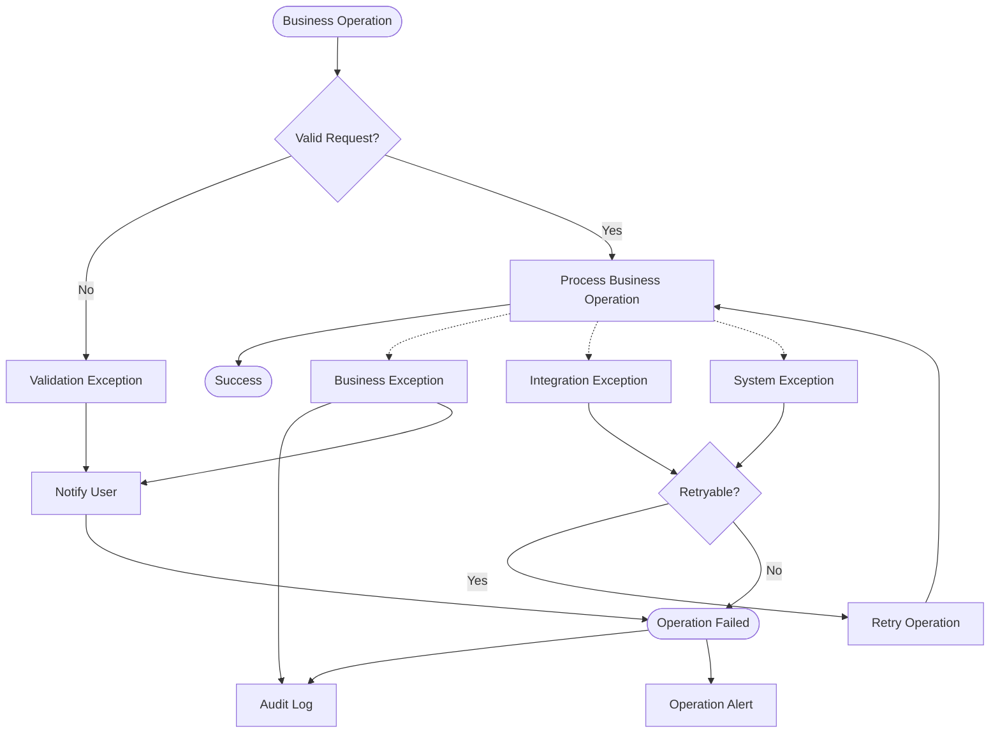

---

# 46. Các Business Rule cần Business Stakeholder xác nhận

Các rule dưới đây có ảnh hưởng lớn đến System Design và cần được chốt trước khi Baseline.

| Priority  | Rule           | Business Decision cần xác nhận                             |
| --------- | -------------- | ---------------------------------------------------------- |
| 🔴 High   | **BR-MAT-005** | Driver Priority được tính như thế nào?                     |
| 🔴 High   | **BR-MAT-009** | Driver Timeout bao nhiêu giây?                             |
| 🔴 High   | **BR-MAT-011** | No Driver thì Booking chuyển State nào?                    |
| 🔴 High   | **BR-BKG-008** | Booking được Cancel ở những State nào?                     |
| 🔴 High   | **BR-TRP-002** | Trip có chính xác những State nào?                         |
| 🔴 High   | **BR-TRP-003** | State Transition nào được phép?                            |
| 🔴 High   | **BR-FAR-002** | Công thức Fare chính thức là gì?                           |
| 🔴 High   | **BR-PAY-007** | Payment có những State nào?                                |
| 🔴 High   | **BR-PAY-008** | Payment Failed xử lý thế nào sau Trip Completed?           |
| 🔴 High   | **BR-PAY-009** | Payment Retry Policy là gì?                                |
| 🔴 High   | **BR-LOC-005** | Location được lưu trong bao lâu?                           |
| 🔴 High   | **BR-DRV-004** | Driver có được nhận nhiều Trip đồng thời không?            |
| 🟡 Medium | **BR-NOT-005** | Notification Failure có Retry bao nhiêu lần?               |
| 🟡 Medium | **BR-OPS-003** | Operation Staff được phép Manual Intervention đến mức nào? |
| 🟡 Medium | **BR-SEC-006** | Những Operation nào bắt buộc Audit?                        |

---

# 47. Các Exception cần Business Stakeholder xác nhận

| Priority  | Exception      | Decision cần xác nhận                             |
| --------- | -------------- | ------------------------------------------------- |
| 🔴 High   | **EX-MAT-001** | No Driver → Cancel, Pending hay Retry?            |
| 🔴 High   | **EX-MAT-002** | Driver Reject → Retry bao nhiêu lần?              |
| 🔴 High   | **EX-MAT-003** | Driver Timeout bao nhiêu giây?                    |
| 🔴 High   | **EX-MAT-007** | Concurrent Accept → cơ chế xác định Driver thắng? |
| 🔴 High   | **EX-BKG-007** | Cancel Booking ở state nào?                       |
| 🔴 High   | **EX-TRP-003** | Điều kiện hợp lệ để Start Trip?                   |
| 🔴 High   | **EX-TRP-005** | Driver Offline bao lâu thì Alert?                 |
| 🔴 High   | **EX-FAR-001** | Fare Calculation Failure xử lý thế nào?           |
| 🔴 High   | **EX-PAY-001** | Payment Timeout → Pending hay Failed?             |
| 🔴 High   | **EX-PAY-003** | Payment Retry tối đa bao nhiêu lần?               |
| 🔴 High   | **EX-PAY-004** | Payment Provider Down → có Fallback Cash không?   |
| 🔴 High   | **EX-PAY-006** | Conflicting Payment Result xử lý thế nào?         |
| 🟡 Medium | **EX-LOC-001** | GPS mất bao lâu thì Location Stale?               |
| 🟡 Medium | **EX-NOT-001** | Notification Retry bao nhiêu lần?                 |
| 🟡 Medium | **EX-OPS-002** | Concurrent Operation xử lý theo Priority nào?     |

---

# 48. Business Rule & Exception Traceability

Business Rule và Exception nên được liên kết với Business Requirement và Functional Requirement.

Ví dụ:

| Business Requirement     | Business Rule | Exception  | Functional Requirement |
| ------------------------ | ------------- | ---------- | ---------------------- |
| BR-03 Booking Management | BR-BKG-002    | EX-BKG-001 | FR-03.01               |
| BR-03 Booking Management | BR-BKG-003    | EX-BKG-002 | FR-03.02               |
| BR-03 Booking Management | BR-BKG-004    | EX-BKG-003 | FR-03.03               |
| BR-04 Driver Matching    | BR-MAT-003    | EX-MAT-005 | FR-04.02               |
| BR-04 Driver Matching    | BR-MAT-004    | EX-DRV-004 | FR-04.03               |
| BR-04 Driver Matching    | BR-MAT-007    | EX-MAT-007 | FR-04.06               |
| BR-04 Driver Matching    | BR-MAT-008    | EX-MAT-002 | FR-04.07               |
| BR-04 Driver Matching    | BR-MAT-009    | EX-MAT-003 | FR-04.08               |
| BR-04 Driver Matching    | BR-MAT-011    | EX-MAT-001 | FR-04.10               |
| BR-05 Trip Execution     | BR-TRP-002    | EX-TRP-001 | FR-05.02               |
| BR-05 Trip Execution     | BR-TRP-007    | EX-TRP-002 | FR-05.03               |
| BR-06 Location           | BR-LOC-003    | EX-LOC-004 | FR-06.03               |
| BR-06 Location           | BR-LOC-004    | EX-LOC-001 | FR-06.04               |
| BR-06 Location           | BR-LOC-005    | EX-LOC-003 | FR-06.07               |
| BR-06 Fare               | BR-FAR-002    | EX-FAR-002 | FR-07.02               |
| BR-06 Payment            | BR-PAY-005    | EX-PAY-004 | FR-08.04               |
| BR-06 Payment            | BR-PAY-007    | EX-PAY-002 | FR-08.06               |
| BR-06 Payment            | BR-PAY-009    | EX-PAY-003 | FR-08.08               |
| BR-06 Notification       | BR-NOT-001    | EX-NOT-001 | FR-09.01 - FR-09.07    |
| BR-06 Notification       | BR-NOT-004    | EX-NOT-002 | FR-09.08               |
| BR-10 Security           | BR-SEC-002    | EX-SEC-001 | FR-12.02               |
| BR-10 Security           | BR-SEC-006    | EX-SEC-003 | FR-12.04               |


